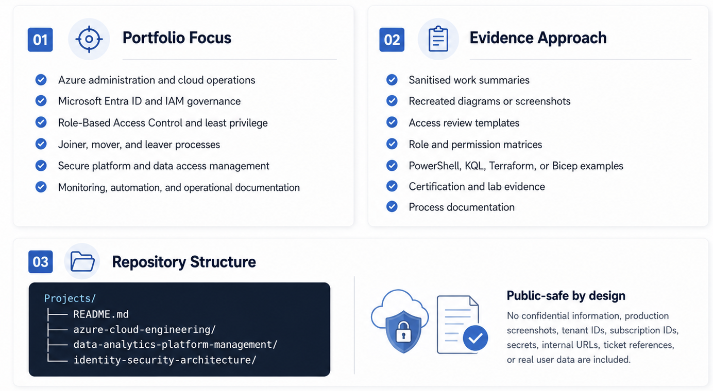

# Portfolio Project Areas

  <strong><a href="../README.md">↩️ Back to Main Portfolio</a></strong>

---

## Project Index

A concise view of the main portfolio areas and the evidence each section demonstrates.

<table>
  <tr>
    <th align="left" width="460">Project Area</th>
    <th align="left">Evidence Demonstrated</th>
  </tr>
  <tr>
    <td width="460" style="white-space: nowrap;">
      ☁️ <strong><a href="azure-cloud-engineering">Azure&nbsp;Cloud&nbsp;Engineering</a></strong>
    </td>
    <td>
      Azure administration, infrastructure as code, monitoring, Entra ID, cloud security governance, and operational evidence.
    </td>
  </tr>
  <tr>
    <td width="460" style="white-space: nowrap;">
      🏛️ <strong><a href="enterprise-security-architecture">Enterprise&nbsp;Security&nbsp;Architecture</a></strong>
    </td>
    <td>
      Identity architecture, secure access design, Conditional Access, least privilege, access governance, and control alignment.
    </td>
  </tr>
  <tr>
    <td width="460" style="white-space: nowrap;">
      📊 <strong><a href="business-intelligence-platform-management">Business&nbsp;Intelligence&nbsp;Platform&nbsp;Management</a></strong>
    </td>
    <td>
      Qlik and Tableau access governance, JML lifecycle controls, licence management, stakeholder validation, and support documentation.
    </td>
  </tr>
</table>

---

  

