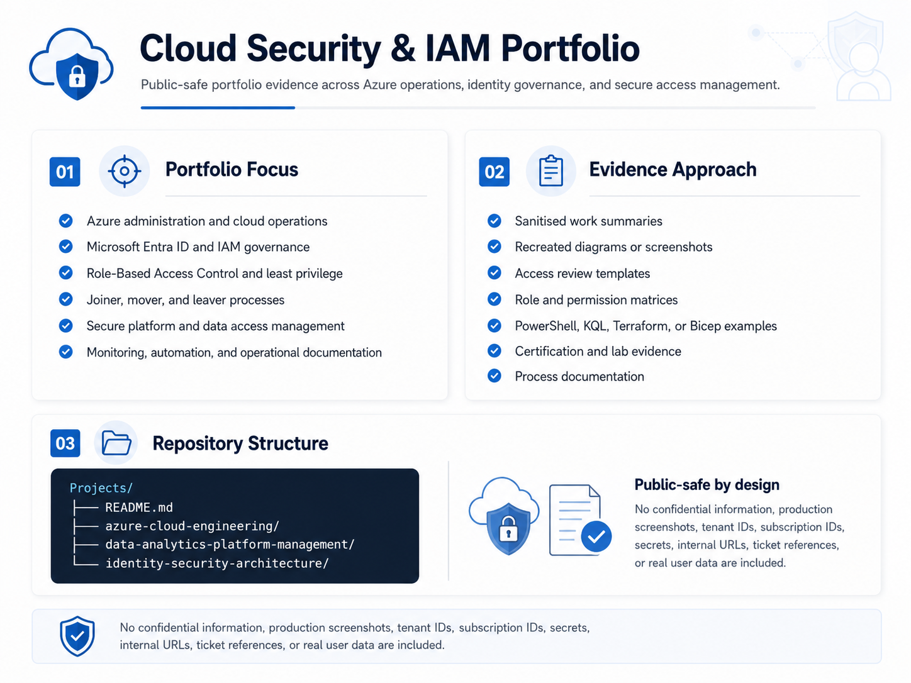

  

## Project Areas

<table>
  <tr>
    <th align="left" width="360">Area</th>
    <th align="left">Evidence Focus</th>
  </tr>
  <tr>
    <td width="360" style="white-space: nowrap;">☁️ <strong><a href="azure-cloud-engineering">Azure&nbsp;Cloud&nbsp;Engineering</a></strong></td>
    <td>Azure administration, Entra ID, RBAC, monitoring, security foundations, and cloud lab evidence.</td>
  </tr>
  <tr>
    <td width="360" style="white-space: nowrap;">🏛️ <strong><a href="identity-security-architecture">Identity&nbsp;Security&nbsp;Architecture</a></strong></td>
    <td>IAM architecture, secure data access, least privilege, access governance, and secure file transfer operations.</td>
  </tr>
  <tr>
    <td width="360" style="white-space: nowrap;">📊 <strong><a href="data-analytics-platform-management">Data&nbsp;Analytics&nbsp;Platform&nbsp;Management</a></strong></td>
    <td>Qlik and Tableau access management, licence tracking, JML workflows, and access review evidence.</td>
  </tr>
</table>
