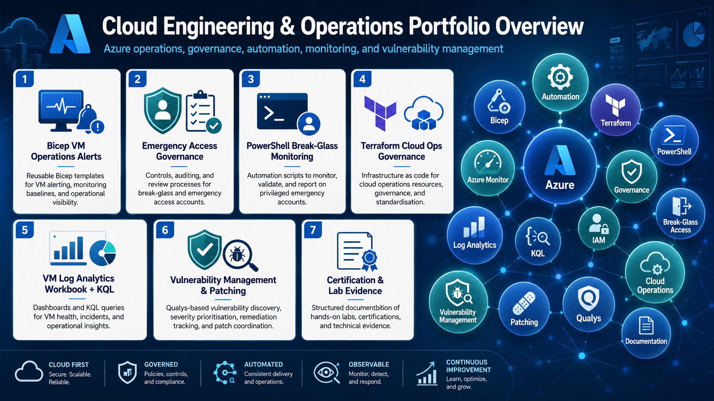

# ☁️ Azure Cloud Engineering

  ↩️ <a href="../../README.md"><strong>Back to Portfolio Home</strong></a> 
  📁 <a href="../README.md"><strong>Back to Projects Index</strong></a>

## Azure Engineering Scope

This section presents practical Azure engineering work across **cloud operations, identity controls, monitoring, governance, infrastructure security, and automation**.

The focus is on professional, workplace-aligned delivery rather than generic lab notes. Projects use sanitised, recreated, or lab-based evidence to demonstrate how Azure environments can be reviewed, secured, monitored, automated, documented, and improved in a controlled operational setting.

  

---
## Azure Engineering Project Index

<table>
  <tr>
    <th align="left" width="460" style="background-color:#f2f4f7;">Project</th>
    <th align="left" style="background-color:#f2f4f7;">Engineering Capability Demonstrated</th>
  </tr>
  <tr>
    <td align="left" width="460" nowrap style="background-color:#f2f4f7;">⚙️ <strong><a href="bicep-infrastructure-and-alerting">Bicep Infrastructure and Alerting</a></strong></td>
    <td align="left">Bicep · infrastructure as code · VM monitoring alerts · Action Groups · heartbeat detection · CPU threshold alerting · operational response readiness</td>
  </tr>
  <tr>
    <td align="left" width="460" nowrap style="background-color:#f2f4f7;">🧱 <strong><a href="terraform-governance-and-standards">Terraform Governance and Standards</a></strong></td>
    <td align="left">Terraform IaC · resource standards · naming and tagging strategy · alert rule configuration · reusable governance patterns · repeatable cloud operations</td>
  </tr>
  <tr>
    <td align="left" width="460" nowrap style="background-color:#f2f4f7;">📊 <strong><a href="monitoring-log-analytics-and-kql">Monitoring, Log Analytics and KQL</a></strong></td>
    <td align="left">Azure Monitor · Log Analytics · Azure Monitor Agent · Data Collection Rules · Data Collection Endpoints · KQL · Workbooks · estate-level reporting</td>
  </tr>
  <tr>
    <td align="left" width="460" nowrap style="background-color:#f2f4f7;">🔐 <strong><a href="identity-emergency-access-governance">Identity and Emergency Access Governance</a></strong></td>
    <td align="left">Microsoft Entra ID · emergency access governance · break-glass controls · Conditional Access review · privileged access resilience · sign-in monitoring logic</td>
  </tr>
  <tr>
    <td align="left" width="460" nowrap style="background-color:#f2f4f7;">🎓 <strong><a href="certification-and-lab-evidence">Certification and Lab Evidence</a></strong></td>
    <td align="left">AZ-104 preparation · administration labs · identity · compute · storage · networking · monitoring · governance validation</td>
  </tr>
</table>
