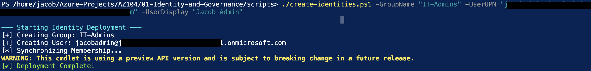
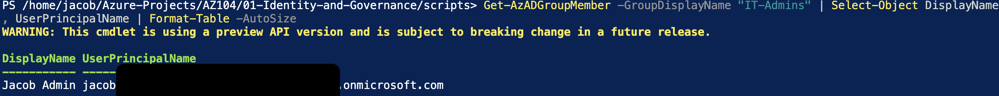
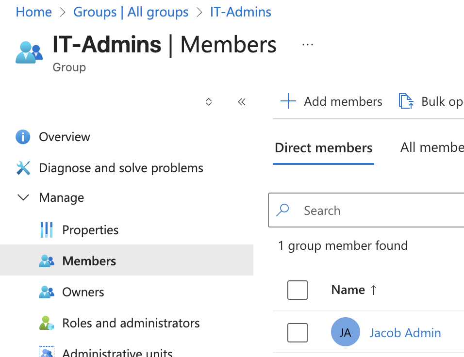
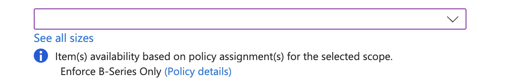

# ☁️ Project 01: Identity Lifecycle & Governance Automation  
**Secure Identity Provisioning, Access Control, and Policy-Driven Governance**

---

## 📌 Overview

This project demonstrates the implementation of **automated identity lifecycle management and governance controls** within Microsoft Entra ID and Azure.

The solution transitions from manual administration to **controlled, repeatable identity provisioning and policy-driven governance**, ensuring that access is consistent, auditable, and aligned to **least privilege principles**.

The objective is to reduce identity-related risk while enabling **scalable and secure access management**.

---

## 🔐 IAM Context

In enterprise environments, identity is the primary security boundary.  
This project focuses on ensuring that:

- Identities are provisioned in a **controlled and standardised manner**  
- Access is assigned through **group-based RBAC models**, not direct user permissions  
- Governance controls prevent misuse of access at the infrastructure layer  

---

## 🧠 Design Rationale

The architecture is built around three core principles:

- **Standardisation:** All identities are created within predefined security groups  
- **Access Control:** Permissions are inherited via RBAC-aligned group membership  
- **Governance Enforcement:** Policy controls restrict what authorised users can deploy  

This approach moves from **ad-hoc identity management** to a **structured IAM model** combining identity, access, and governance.

---

## 🛠️ Technical Stack

| Category | Tools Used | IAM / Security Relevance |
| :--- | :--- | :--- |
| **Identity** | Microsoft Entra ID | Centralised identity and access control |
| **Access Control** | RBAC | Role-based permission enforcement |
| **Automation** | Azure PowerShell (Az Module) | Repeatable identity provisioning |
| **Governance** | Azure Policy (JSON) | Enforcement of organisational controls |

---

## 📌 Implementation

### 1. Identity Lifecycle Automation

Manual user provisioning introduces risk through inconsistent permissions and unmanaged identities.  
To address this, I developed [`create-identities.ps1`](./scripts/create-identities.ps1) to automate onboarding.

#### Key Features
- Programmatic user creation  
- Automatic group assignment (`IT-Admins`)  
- Immediate RBAC alignment  

> Automated provisioning ensures consistent identity creation within controlled access structures.

---

### 2. Access Control Model (RBAC)

Access is not assigned directly to users.  
Instead, users inherit permissions through group membership.

#### IAM Design Decisions
- Prevents **privilege creep**  
- Simplifies access management at scale  
- Supports **least privilege enforcement**  

> CLI validation ensures identity objects and group assignments are accurate and auditable.

---

### 3. Identity Validation & Synchronisation

Provisioned identities were validated using CLI and portal checks to ensure:

- Correct group membership  
- Accurate mapping of user principal names  
- Consistency across Entra ID  

---

## ⚖️ Phase 2: Governance & Control Enforcement

To prevent misuse of access privileges, I implemented **policy-driven governance controls**.

### Policy-as-Code Implementation

A custom JSON policy was developed to restrict Virtual Machine deployments to **cost-optimised SKUs**.

- Script: [`deploy-governance.ps1`](./scripts/deploy-governance.ps1)  
- Policy: [`Enforce-Cost-Optimised-VM-Sizes.json`](./policies/Enforce-Cost-Optimised-VM-Sizes.json)

---

### Control Enforcement

Attempts to deploy non-compliant resources are blocked at the **Azure Resource Manager (ARM)** layer.

---

### IAM Relevance

- Prevents authorised users from deploying unauthorised resources  
- Enforces organisational policy regardless of permissions  
- Adds a **control layer beyond RBAC**  

---

## ⚖️ Design Considerations & Trade-offs

- Automation improves consistency but requires script maintenance  
- Group-based access improves scalability but requires governance discipline  
- Policy enforcement improves security but can restrict operational flexibility  

---

## 🎯 Outcome

This project demonstrates a structured approach to IAM, combining:

- Automated identity lifecycle management  
- Group-based access control (RBAC)  
- Policy-driven governance enforcement  
- Scalable and auditable identity operations  

---

## 🧠 Key IAM Outcomes

- **Consistent Identity Provisioning:** Eliminates manual errors and unmanaged identities  
- **Access Governance:** Ensures permissions are assigned through controlled structures  
- **Policy Enforcement:** Prevents misuse of access privileges  
- **Operational Scalability:** Enables repeatable, auditable identity processes  

---

## 🔮 Future Enhancements

- Integration with CI/CD pipelines for governance deployment (GitOps model)  
- Implementation of Privileged Identity Management (PIM)  
- Conditional Access policy design and enforcement  

---

*Maintained by Jacob Adedoyin*
