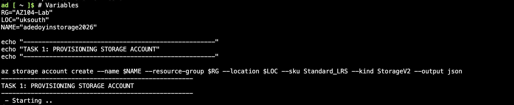
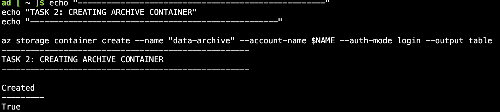
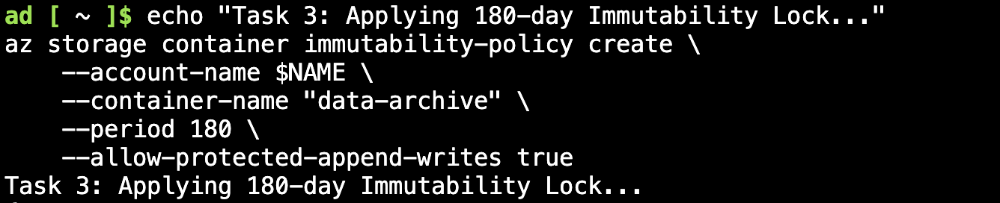
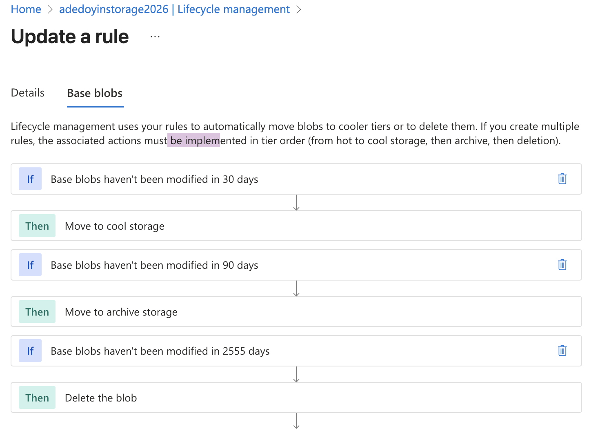

# 📦 Project 02: Data Protection & Secure Storage

---

## 🎯 Objective

Design and implement a **secure data storage and access model** that ensures data integrity, controlled access, and compliance with retention requirements.

This project demonstrates how **data protection, identity-based access control, and governance policies** work together to secure cloud storage and reduce risk.

---

## 🧠 Design Rationale

The solution is built around **protecting data through identity, governance, and lifecycle control**:

- **Identity-Based Access:** All data access is enforced through Microsoft Entra ID rather than shared keys  
- **Data Integrity:** Immutability policies prevent deletion or modification of critical data  
- **Lifecycle Governance:** Automated tiering ensures cost-efficient and compliant data retention  
- **Controlled Compute Access:** Container workloads interact with storage through restricted access paths  

This reflects a shift from **open storage access models** to **identity-aware, policy-driven data protection**.

---

## 🔐 IAM & Security Alignment

This implementation supports key IAM principles:

- **Least Privilege:** Access to storage is restricted via RBAC roles  
- **Identity-Based Access:** Eliminates use of shared keys in favour of Entra ID authentication  
- **Defence in Depth:** Combines RBAC, immutability, and lifecycle policies  
- **Auditability:** Access and changes are governed and traceable  

---

## 🛠️ Technical Stack

| Category | Tools Used | Security Relevance |
| :--- | :--- | :--- |
| **Storage** | Azure Blob Storage (GPv2) | Secure, scalable data storage |
| **Identity** | Microsoft Entra ID (RBAC) | Access control enforcement |
| **Governance** | Immutability Policies (WORM) | Data protection and compliance |
| **Automation** | Azure CLI (Bash) | Repeatable deployment |
| **Compute** | Azure Container Instances (ACI) | Controlled, ephemeral workloads |

---

## 📌 Implementation

### 1. Secure Storage Deployment

Storage infrastructure was deployed using Azure CLI to ensure repeatability and consistent configuration.

- Region: UK South (data residency)  
- Replication: Locally Redundant Storage (LRS)  
- Architecture: General Purpose v2 for lifecycle and policy support  

---

### 2. Identity-Based Access Control

Instead of using storage account keys, access is enforced via **Microsoft Entra ID authentication**.

#### Key Decisions
- Disabled reliance on shared keys  
- Enforced `--auth-mode login` for CLI operations  
- Restricted access through RBAC roles  

> Ensures access is identity-driven and aligned to Zero Trust principles.

---

### 3. Data Protection (Immutability)

A **time-based retention policy (180 days)** was applied to enforce **Write Once, Read Many (WORM)** behaviour.

#### Security Impact
- Prevents deletion or modification of stored data  
- Protects against ransomware and insider threats  
- Ensures compliance with regulatory retention requirements  

---

### 4. Lifecycle Governance

A JSON-defined lifecycle policy was implemented to automate data ageing:

- Move to Cool Tier after 30 days  
- Move to Archive Tier after 90 days  
- Delete after 7 years (regulatory retention)  

> Reduces operational overhead while enforcing consistent retention policies.

---

### 5. Secure Compute Integration (ACI)

A containerised workload was deployed using Azure Container Instances.

#### Security Considerations
- Ephemeral compute reduces persistent attack surface  
- No direct infrastructure management required  
- Access to resources controlled via identity and configuration  

---

## ⚖️ Design Considerations & Trade-offs

- Immutability improves security but limits operational flexibility  
- Identity-based access is more secure but requires role management discipline  
- Lifecycle policies reduce cost but require careful retention planning  
- ACI simplifies deployment but reduces infrastructure-level control  

---

## 🎯 Outcome

This project demonstrates how secure storage design integrates:

- Identity-based access control  
- Data protection through immutability  
- Automated governance and lifecycle management  
- Controlled compute interaction with data  

Resulting in a **secure, compliant, and scalable data architecture**.

---

## 🧠 Key Outcomes

- **Secure Data Access:** Eliminated shared keys in favour of identity-based control  
- **Data Integrity:** Protected critical data using WORM policies  
- **Governance Automation:** Enforced retention and cost optimisation through policy  
- **Operational Efficiency:** Reduced manual management through automation  

---

## 🔮 Future Enhancements

- Integration with Private Endpoints for network-level isolation  
- Implementation of Managed Identities for ACI access to storage  
- Advanced monitoring and alerting for data access patterns  

---

*Maintained by Jacob Adedoyin*
