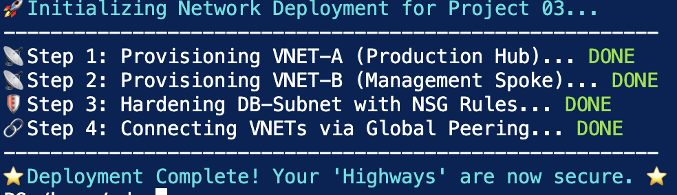
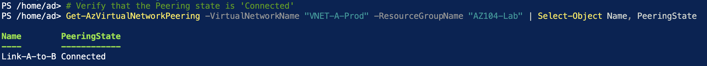
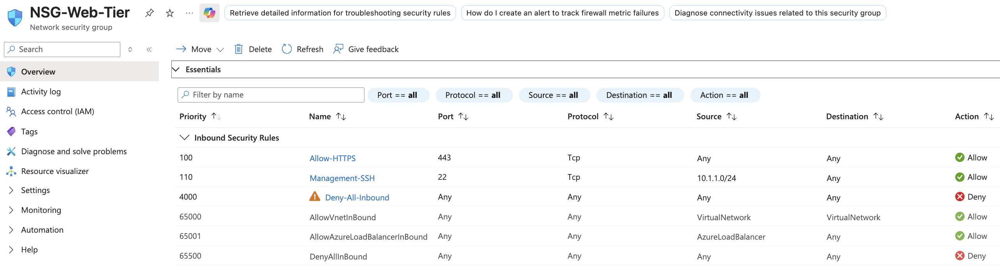
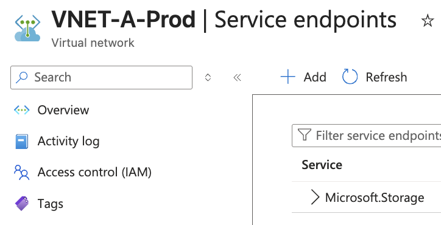
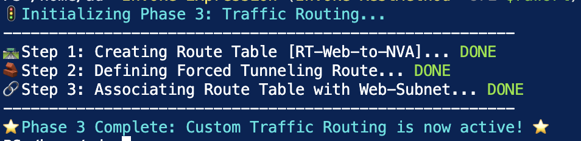

# 🌐 Project 03: Network Security & Traffic Control  
**Segmentation, Access Boundaries, and Controlled Traffic Flow**

---

## 🎯 Objective

Design and implement a **segmented and secure network architecture** that enforces controlled communication between resources.

This project demonstrates how **network design, traffic control, and security rules** act as an extension of **identity and access management**, ensuring that systems can only communicate where explicitly permitted.

---

## 🧠 Design Rationale

The architecture is built around **controlling access through network boundaries**:

- **Segmentation:** Isolating workloads into separate subnets  
- **Controlled Communication:** Allowing only required traffic paths  
- **Traffic Governance:** Forcing traffic through defined routes  
- **Defence in Depth:** Combining network and identity controls  

This reflects a move from **flat, open networks** to **Zero Trust-aligned infrastructure**.

---

## 🔐 IAM & Security Alignment

This implementation supports key IAM principles:

- **Least Privilege (Network Level):** Only required ports and sources are allowed  
- **Access Boundaries:** Network segmentation restricts lateral movement  
- **Policy Enforcement:** Traffic rules act as control layers beyond identity permissions  
- **Defence in Depth:** Network controls complement RBAC and identity-based access  

---

## 🛠️ Technical Stack

| Category | Tools Used | Security Relevance |
| :--- | :--- | :--- |
| **Networking** | Virtual Networks, Subnets, Peering | Segmentation and isolation |
| **Security** | Network Security Groups (NSGs) | Traffic filtering and access control |
| **Routing** | User-Defined Routes (UDR) | Controlled traffic flow |
| **Connectivity** | VNet Peering | Private communication backbone |
| **Automation** | PowerShell | Repeatable deployment |

---

## 📌 Implementation

### 1. Segmented Network Architecture

A **hub-and-spoke model** was implemented to isolate workloads and enforce structured communication paths.

- Web tier separated from management and backend tiers  
- Distinct subnets used for isolation  
- Address space designed to support scalability  

---

### 2. Private Connectivity (VNet Peering)

VNet peering was configured to allow **private communication between networks** without exposure to the public internet.

- Uses Microsoft backbone  
- Low latency and secure  
- Eliminates need for public endpoints  

---

### 3. Network Security Enforcement (NSGs)

Network Security Groups were applied to enforce **strict inbound traffic rules**.

#### Example Rule Set
- Allow HTTPS (443) from public sources  
- Restrict SSH (22) to management subnet only  
- Deny all other inbound traffic  

> Enforces least privilege at the network layer.

---

### 4. Data Access Restriction (Service Endpoints)

Storage access was restricted to trusted subnets using service endpoints.

- Prevents access from external networks  
- Ensures data is only accessible from approved workloads  

---

### 5. Traffic Control (User-Defined Routes)

Custom routing was implemented to control how traffic flows between subnets.

- Internet-bound traffic redirected to defined next hop  
- Supports integration with firewalls or NVAs  
- Overrides default Azure routing behaviour  

---

## ⚖️ Design Considerations & Trade-offs

- Segmentation improves security but increases complexity  
- Strict NSG rules reduce risk but require ongoing management  
- Custom routing enables control but adds operational overhead  
- Private connectivity improves security but requires planning of address space  

---

## 🎯 Outcome

This project demonstrates how network design contributes to secure cloud environments through:

- Segmented infrastructure  
- Controlled communication paths  
- Enforced traffic restrictions  
- Integration with identity-based access control  

---

## 🧠 Key Outcomes

- **Reduced Attack Surface:** Limited exposure through strict inbound rules  
- **Controlled Access:** Enforced communication only between authorised components  
- **Improved Security Posture:** Combined network and identity controls  
- **Scalable Design:** Structured architecture supporting future growth  

---

## 🔮 Future Enhancements

- Integration with Azure Firewall or Network Virtual Appliance (NVA)  
- Implementation of Private Endpoints for storage and services  
- Automated network policy deployment via CI/CD pipelines  

---

*Maintained by Jacob Adedoyin*
