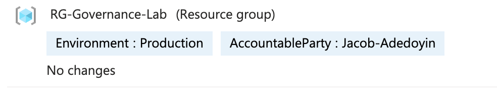
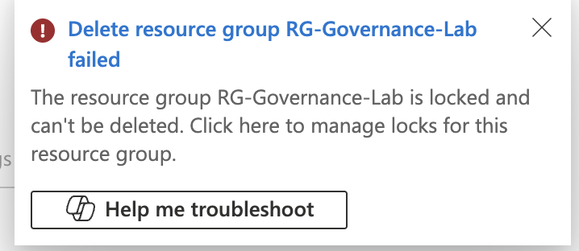

# 🏛️ Project 01: Identity Governance & Resource Control

---

## 🎯 Objective

Design and implement a governance model that enforces **controlled access, accountability, and protection of cloud resources**, reducing the risk of unauthorised or accidental changes.

This project demonstrates how governance controls support **Identity and Access Management (IAM)** by ensuring resource access is structured, auditable, and aligned to **least privilege principles**.

---

## 🧠 Design Rationale

The governance model is applied at the **resource group level** to enforce consistency, simplify access control, and ensure inheritance across all contained resources.

- **Identity Accountability:** Tagging strategy links resources to accountable owners, supporting access governance and auditability  
- **Defence in Depth:** Resource locks provide a control layer beyond RBAC, preventing destructive actions even when permissions allow  
- **Scalability:** Group-level controls reduce administrative overhead and enforce consistent governance across environments  
- **Automation:** PowerShell used to eliminate manual configuration risk and enable repeatable governance enforcement  

This reflects a shift from **permission-only control** to **layered governance**, combining identity, access, and resource protection.

---

## 🔐 IAM & Governance Alignment

This implementation supports key IAM principles:

- **Least Privilege:** Restricts ability to delete or modify resources beyond intended access  
- **Accountability:** Maps resources to identifiable owners via tagging  
- **Defence in Depth:** Combines RBAC with resource-level controls  
- **Auditability:** Ensures ownership and control decisions are visible and traceable  

---

## 🛠️ Technical Stack

| Category | Tools Used | IAM / Security Relevance |
| :--- | :--- | :--- |
| **Cloud Platform** | Microsoft Azure | Identity-integrated resource management |
| **Identity & Access** | Microsoft Entra ID, RBAC | Access control and permission enforcement |
| **Governance** | Azure Policy | Automated compliance and standard enforcement |
| **Security** | Resource Locks | Protection beyond permission-based controls |
| **Automation** | PowerShell, Azure CLI | Consistent application of governance controls |

---

## 📌 Implementation

### 1. Resource Tagging & Identity Accountability

A standardised tagging taxonomy was implemented at the resource group level to ensure resources are linked to identifiable owners and environments.

#### Tagging Strategy
- **Environment:** separates production and non-production access boundaries  
- **AccountableParty:** identifies responsible owner for access and operational management  

> Tagging supports identity governance by linking resources to accountable individuals and enabling traceability.

---

### 2. Resource Locks & Access Control Guardrails

A PowerShell script ([`apply-group-lock.ps1`](./scripts/apply-group-lock.ps1)) was used to apply a **CanNotDelete** lock at the resource group level.

#### IAM Relevance
- Prevents destructive actions even when permissions allow it  
- Adds a secondary control layer beyond RBAC  
- Reduces risk from misconfigured or over-privileged access  

---

### 3. Validation: Control Enforcement

Deletion attempts at both:
- Resource Group level  
- Individual resource level  

were blocked by Azure Resource Manager due to lock inheritance.

> Demonstrates enforcement of governance controls independent of user permissions.

---

## ⚖️ Design Considerations & Trade-offs

- Applying locks at group level improves security but reduces operational flexibility  
- Tagging requires consistent enforcement; without policy validation, accuracy can degrade  
- Governance controls must balance **security, usability, and operational efficiency**  

---

## 🎯 Outcome

This project demonstrates how governance controls extend IAM beyond permissions by introducing **structured, enforceable controls** that:

- Reduce risk of accidental or unauthorised actions  
- Improve accountability and ownership visibility  
- Support scalable access governance in cloud environments  
