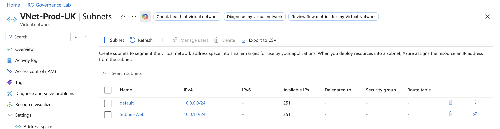
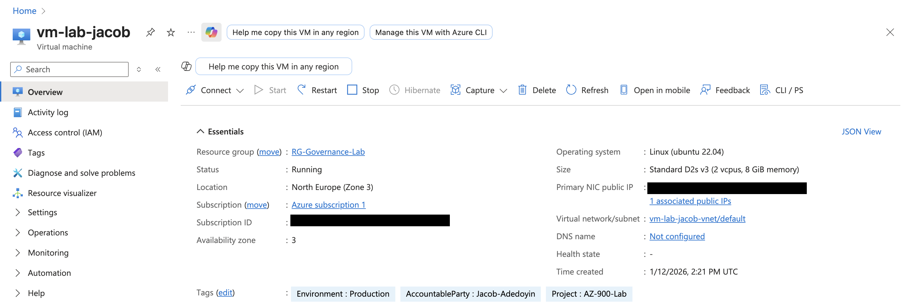
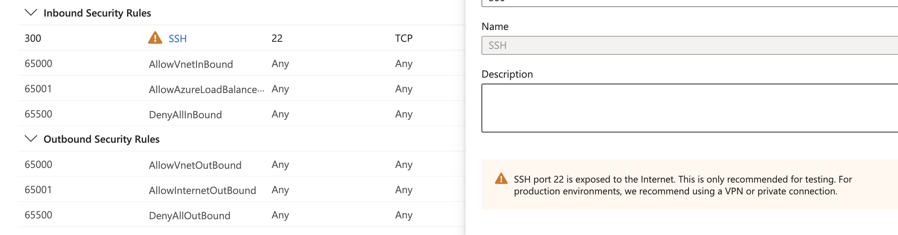

# 🖥️ Project 02: Secure Compute & Network Access Control

---

## 🎯 Objective

Design and deploy a **secure compute and networking environment** that enforces controlled access, reduces attack surface, and aligns infrastructure with **identity and access management (IAM) principles**.

This project focuses on implementing **network-level controls** that complement identity-based access (RBAC), forming a layered security model aligned to **Zero Trust and least privilege**.

---

## 🧠 Design Rationale

The environment is designed to ensure that **access is explicitly controlled at both the identity and network layers**.

- **Network Segmentation:** Limits lateral movement between workloads  
- **Controlled Access Paths:** Restricts inbound access to authorised administrative endpoints only  
- **Defence in Depth:** Combines NSG rules with identity-based access controls  
- **Scalability:** Structured address space supports future growth without redesign  

This reflects a move from **open infrastructure access** to **restricted, identity-aware access control models**.

---

## 🔐 IAM & Security Alignment

This implementation supports core IAM principles:

- **Least Privilege:** Only authorised IPs can access administrative services  
- **Access Control Layers:** Combines RBAC with network-level restrictions  
- **Attack Surface Reduction:** Removes unnecessary exposure to public internet  
- **Controlled Administrative Access:** Limits who can connect, how, and from where  

---

## 🛠️ Technical Stack

| Category | Tools Used | Security Relevance |
| :--- | :--- | :--- |
| **Compute** | Azure Virtual Machines (Ubuntu 22.04) | Secure workload hosting |
| **Networking** | Virtual Network, Subnets | Segmentation and isolation |
| **Security** | Network Security Groups (NSGs) | Traffic filtering and access restriction |
| **Availability** | Availability Zones | Resilience and fault tolerance |
| **Region** | North Europe | Compliance and regional alignment |

---

## 📌 Implementation

### 1. Network Segmentation

A structured virtual network was designed to isolate workloads and reduce the risk of lateral movement.

#### Architecture Decisions
- **Address Space:** `10.0.0.0/16` for scalability  
- **Subnet Separation:** Logical segmentation of workloads  
- **Regional Placement:** North Europe selected for compliance and latency  

> Network segmentation reduces the blast radius of potential compromise.

---

### 2. Secure Compute Deployment

A Linux VM was deployed within the segmented network, with availability configured to ensure resilience.

#### Key Configuration
- **VM Size:** Standard D2s v3  
- **Availability Zone:** Zone 3 (fault isolation)  
- **Tagging:** Applied for ownership and cost tracking  

---

### 3. Network Security Hardening

Initial configuration exposed a critical risk:

- SSH (Port 22) open to **Any source**

This represents a common misconfiguration that increases exposure to automated attacks.

---

### 4. Access Control Enforcement

The risk was mitigated by implementing **IP-based access restrictions**:

- SSH access restricted to a **single trusted administrative IP**
- All other inbound traffic blocked by default rules  

#### IAM Relevance
- Enforces **least privilege at network level**  
- Prevents misuse even if credentials are compromised  
- Adds a control layer beyond identity permissions  

---

## ⚖️ Design Considerations & Trade-offs

- Restricting SSH access improves security but reduces operational flexibility  
- IP-based access control is effective but requires management of trusted endpoints  
- Network controls must complement identity controls, not replace them  

---

## 🎯 Outcome

This project demonstrates how **network and compute design support IAM principles**, introducing:

- Controlled administrative access  
- Reduced attack surface  
- Layered security beyond RBAC  
- Scalable and secure infrastructure design  
