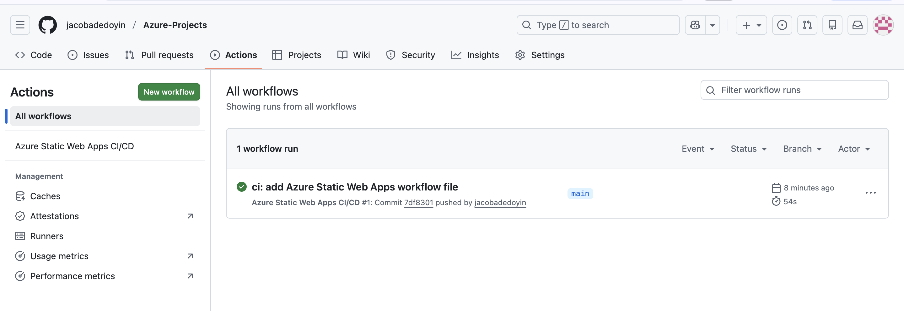
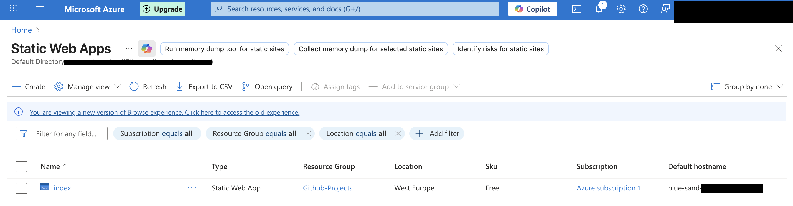
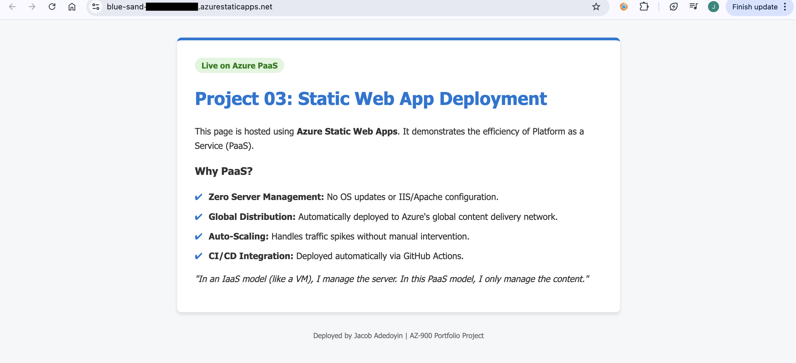

# 🌐 Project 03: Secure Application Deployment & CI/CD Control

---

## 🎯 Objective

Design and implement a **secure application deployment pipeline** that automates delivery while maintaining **controlled access, auditability, and consistency**.

This project demonstrates how CI/CD pipelines integrate with **Identity and Access Management (IAM)** to ensure deployments are authorised, traceable, and aligned to **least privilege principles**.

---

## 🧠 Design Rationale

The solution is designed to ensure that **application deployment is controlled, repeatable, and secure**.

- **Controlled Deployment Flow:** Code changes are only deployed through version-controlled pipelines  
- **Identity-Based Access:** Deployment permissions are governed through repository and platform access controls  
- **Automation:** Eliminates manual deployment risk and enforces consistent processes  
- **Serverless Architecture:** Reduces infrastructure exposure and operational overhead  

This reflects a move from **manual deployment processes** to **controlled, identity-driven release management**.

---

## 🔐 IAM & Security Alignment

This implementation supports key IAM principles:

- **Controlled Access:** Only authorised users can trigger or approve deployments  
- **Auditability:** All changes are tracked through version control and pipeline execution logs  
- **Least Privilege:** Deployment permissions are restricted to required roles only  
- **Operational Integrity:** Prevents unauthorised or inconsistent changes to production environments  

---

## 🛠️ Technical Stack

| Category | Tools Used | Security Relevance |
| :--- | :--- | :--- |
| **Cloud Platform** | Azure Static Web Apps | Managed hosting with reduced attack surface |
| **CI/CD** | GitHub Actions | Controlled and automated deployment pipeline |
| **Version Control** | Git / GitHub | Source of truth and change tracking |
| **Deployment Model** | Continuous Deployment | Consistent and repeatable release process |
| **Delivery** | Azure CDN | Secure, global content distribution |

---

## 📌 Implementation

### 1. CI/CD Pipeline Automation

A **GitHub Actions workflow** was configured to automate application deployment.

- Trigger: Push to `main` branch  
- Action: Build and deploy application to Azure  
- Outcome: Eliminates manual deployment and ensures consistency  

> Automated pipeline ensures controlled and repeatable deployments.

---

### 2. Secure Application Hosting (PaaS)

The application is hosted using **Azure Static Web Apps**, removing the need for infrastructure management.

#### Security Benefits
- No direct server access required  
- Reduced attack surface compared to IaaS hosting  
- Built-in scaling and availability  

---

### 3. Global Distribution & Performance

The application is delivered through Azure’s global CDN, ensuring:

- Low latency  
- High availability  
- Consistent user experience  

---

## ⚖️ Design Considerations & Trade-offs

- Fully automated deployments improve speed but require strong access control on source repositories  
- CI/CD pipelines introduce dependency on workflow configuration and maintenance  
- Serverless architecture reduces control over infrastructure but improves security and scalability  

---

## 🎯 Outcome

This project demonstrates how **deployment processes can be secured through IAM principles**, introducing:

- Controlled and auditable release processes  
- Reduced risk of unauthorised changes  
- Consistent deployment workflows  
- Scalable and secure application delivery  
