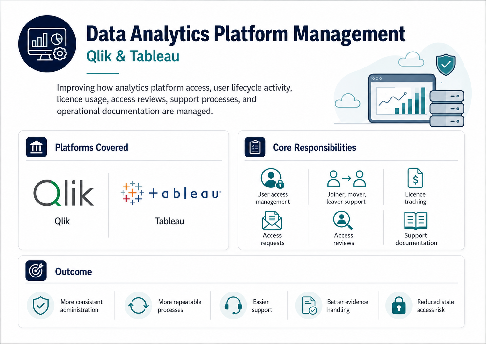
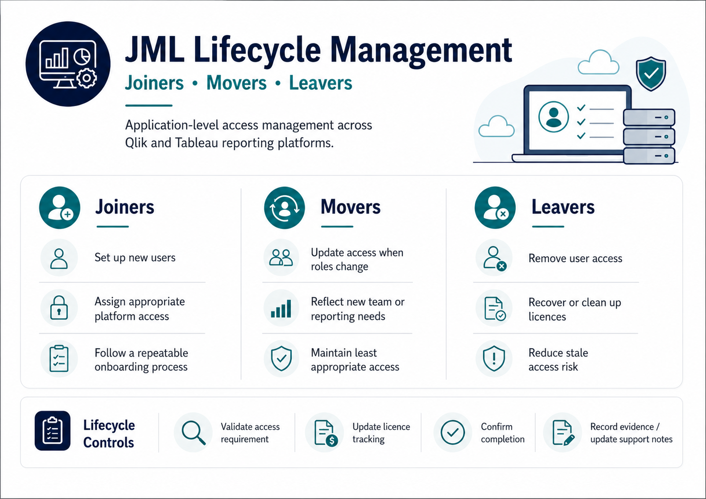
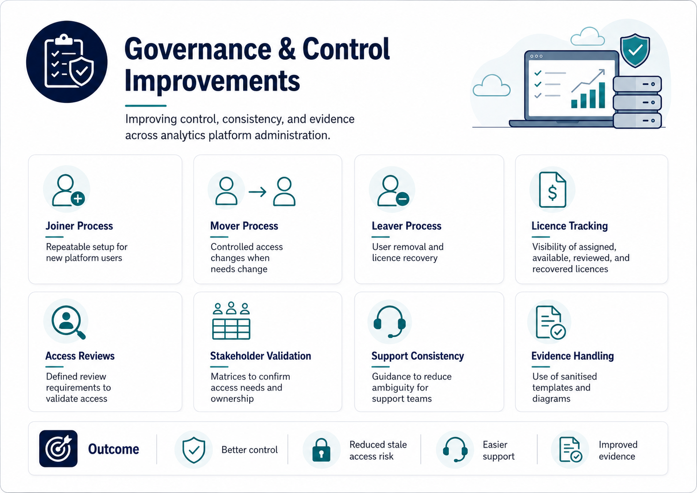
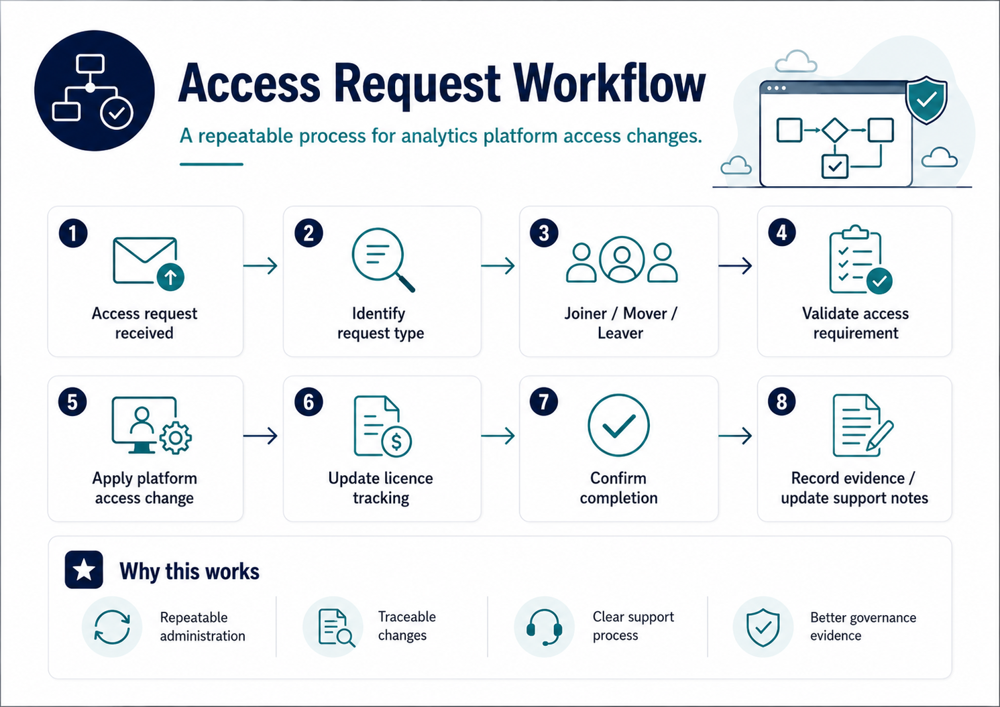

# Data Analytics Platform Management



## Overview

This project demonstrates practical **data analytics platform management** across **Qlik** and **Tableau**, with a focus on user access, licence management, access reviews, support processes, and operational documentation.

The work improved how analytics platform administration was managed by making access processes more consistent, repeatable, supportable, and easier to evidence.

This project is relevant to **Identity and Access Management (IAM)** because it involved managing user access lifecycle activity across application-level analytics platforms, including joiners, movers, leavers, licence clean-up, and access review preparation.

---

## Platforms Covered

| Platform | Focus |
|---|---|
| Qlik | Platform administration, user access support, licence visibility, and support documentation |
| Tableau | User access management, licence tracking, stakeholder validation, and lifecycle support |

---

## Project Context

The work focused on improving access and administration processes across analytics platforms used for reporting and data analysis.

| Area | Description |
|---|---|
| Joiners | Setting up new users and assigning appropriate platform access |
| Movers | Updating access when users changed role, team, reporting requirement, or access need |
| Leavers | Supporting user removal, licence clean-up, and offboarding to reduce stale access risk |
| Licence Management | Tracking licence allocation, availability, review status, and recovery activity |
| Access Reviews | Defining review requirements and using matrices to support stakeholder validation |
| Platform Support | Improving support guidance and repeatable administration processes |

Although this was not Azure-native IAM, it supported access governance by making analytics platform access management more controlled, documented, and repeatable.

---

## JML Lifecycle Management



A key part of this work was improving the management of platform access across the **joiner, mover, and leaver lifecycle**.

| Lifecycle Stage | Work Completed | Control Benefit |
|---|---|---|
| Joiners | Supported new user setup and access assignment | Improved onboarding consistency |
| Movers | Updated access when roles, teams, or reporting needs changed | Helped keep access aligned to business need |
| Leavers | Supported user removal and licence recovery | Reduced stale access and unnecessary licence usage |

This helped reduce reliance on informal process knowledge and made platform access activity easier to follow, repeat, and evidence.

---

## Governance and Control Improvements



The project improved control over analytics platform access by making lifecycle, review, and support activity more structured.

| Control Area | Improvement |
|---|---|
| Joiner process | Created a more repeatable approach for setting up new platform users |
| Mover process | Improved how access changes were handled when roles, teams, or reporting needs changed |
| Leaver process | Supported user removal and licence recovery to reduce stale access risk |
| Licence tracking | Improved visibility of assigned, available, reviewed, and recovered licences |
| Access reviews | Defined review requirements to help validate whether access was still appropriate |
| Stakeholder validation | Created matrices to help stakeholders confirm access needs and ownership |
| Support consistency | Created guidance to reduce ambiguity for support teams |
| Evidence handling | Used sanitised templates and diagrams instead of confidential operational records |

---

## Access Request Workflow



A repeatable access request workflow was used to make platform administration more consistent and easier to evidence.

```text
Access request received
        ↓
Identify request type
        ↓
Joiner / Mover / Leaver
        ↓
Validate access requirement
        ↓
Apply platform access change
        ↓
Update licence tracking
        ↓
Confirm completion
        ↓
Record evidence / update support notes
