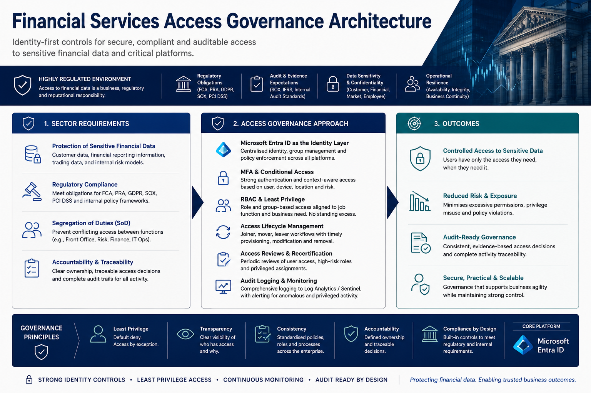
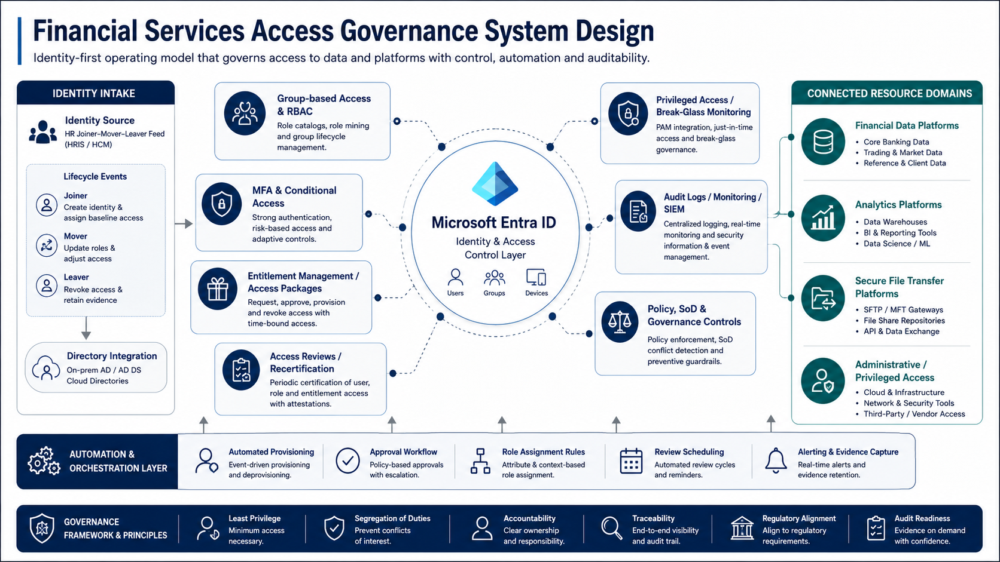

# 🏦 Financial Services Access Governance Architecture

  <strong><a href="../README.md">← Back to Identity Security Architecture</a></strong>

## Overview

This project presents a public-safe access governance architecture for sensitive financial services data platforms.

Financial services environments require strong identity controls because access affects confidentiality, auditability, segregation of duties, reporting integrity, and trust in business-critical data. The design uses Microsoft Entra ID as the central identity layer, supported by MFA, Conditional Access, RBAC, least privilege, access reviews, and audit logging.

  

---

## Governance Design

The design focuses on how identity, access control, monitoring, and governance processes work together to reduce access risk and support audit-ready operations.

  

---
