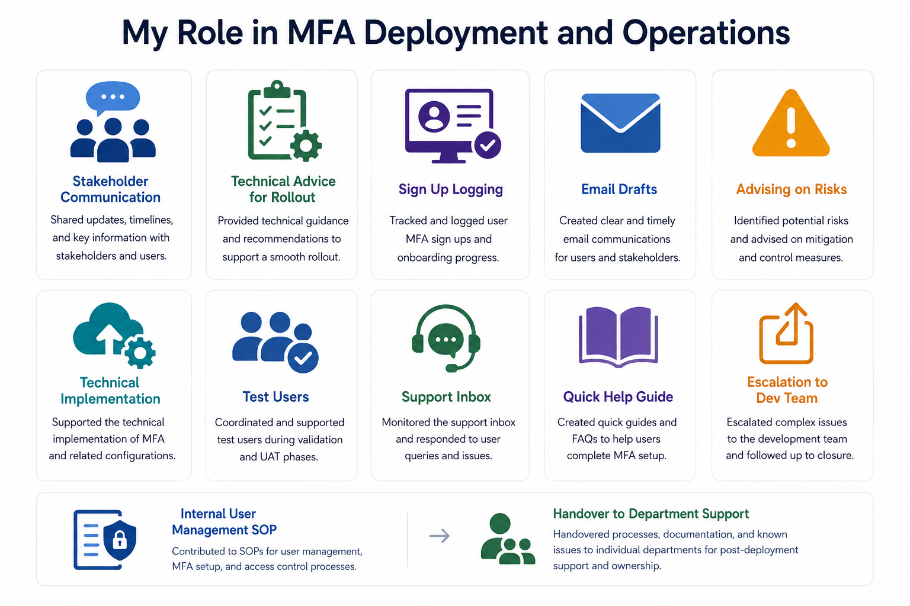
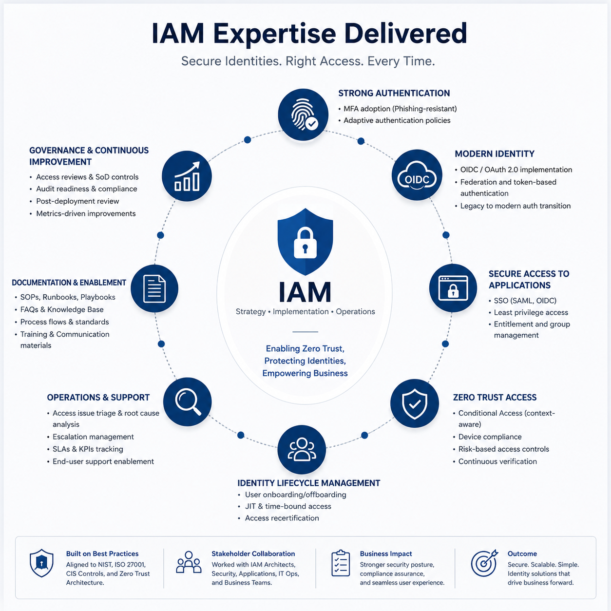

# 🔐 MFA Application Deployment and Operations

[← Back to Identity Security Architecture](../README.md)

## Overview

Practical IAM project covering MFA rollout and secure application access support for Qlik and Tableau data platforms.

The work focused on user readiness, authentication transition support, access issue triage, documentation, stakeholder communication, and post-deployment improvement.

## Project Scope

| Area | Evidence of Experience |
|---|---|
| MFA rollout support | Helped users prepare for MFA adoption and secure sign-in changes |
| Application access | Supported secure access to Qlik and Tableau data platforms |
| OIDC transition | Assisted with authentication transition and user readiness activity |
| Access issue triage | Investigated setup, login, and access problems before escalation |
| Stakeholder support | Supported communications, guidance, and user-facing rollout activity |
| Documentation | Contributed to SOPs, FAQs, quick guides, and support handover material |
| Post-go-live improvement | Identified recurring issues and improvement opportunities after deployment |

## IAM Skills Demonstrated

