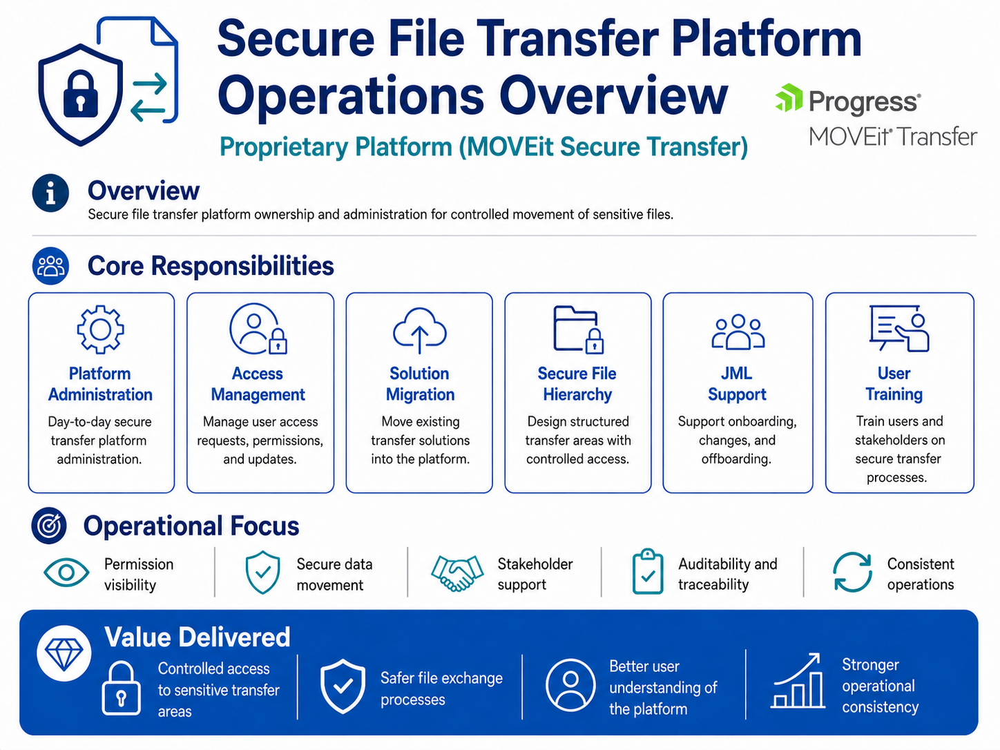

# 📁 Secure File Transfer Platform Operations

  📁 <a href="../../README.md"><strong>Back to Projects Index</strong></a>
  
  ↩️ <a href="../README.md"><strong>Back to Enterprise Security Architecture</strong></a> 

## Overview

This project demonstrates operational ownership of a secure file transfer platform used to control the movement of sensitive business files.

The work focused on secure platform administration, access control, folder permissions, migration support, joiner/mover/leaver activity, stakeholder guidance, and repeatable operational processes.

## Platform

- MOVEit Secure Transfer

## Project Scope

| Area | What this demonstrates |
|---|---|
| Secure platform administration | Supported day-to-day operation of a managed file transfer platform |
| Access management | Created, changed, reviewed, and removed user access based on business need |
| Folder permission control | Supported folder hierarchy design and permission visibility |
| Least privilege | Helped ensure users only had access to the folders and transfer areas they required |
| JML support | Supported joiner, mover, and leaver activity to reduce stale or inappropriate access |
| Migration support | Assisted with controlled migration activity, validation, and user readiness |
| Stakeholder support | Guided users and stakeholders on secure transfer processes |
| Documentation | Produced templates, checklists, and repeatable operational guidance |

## IAM and Security Skills

Key skills demonstrated:

- Secure file transfer administration
- IAM operational support
- Least privilege access control
- Folder-level permission management
- Joiner, mover, and leaver controls
- Access request handling
- Permission matrix design
- Secure data movement awareness
- Audit and traceability awareness
- Stakeholder training and support
- Operational documentation

## Operations Workflow

## Evidence Pack

| Evidence | Location |
|---|---|
| Operations overview | [`secure-file-transfer-operations-overview.png`](../../../assets/identity-security-architecture/secure-file-transfer-operations-overview.png) |
| IAM and access control skills | [`secure-transfer-iam-access-control-skills.png`](../../../assets/identity-security-architecture/secure-transfer-iam-access-control-skills.png) |
| Access operations workflow | [`secure-transfer-access-operations-workflow.png`](../../../assets/identity-security-architecture/secure-transfer-access-operations-workflow.png) |
| Access request template | [`secure-transfer-access-request-template.md`](../../../assets/identity-security-architecture/secure-transfer-access-request-template.md) |
| Migration checklist | [`secure-transfer-migration-checklist.md`](../../../assets/identity-security-architecture/secure-transfer-migration-checklist.md) |
| Permission matrix template | [`secure-transfer-permission-matrix-template.md`](../../../assets/identity-security-architecture/secure-transfer-permission-matrix-template.md) |

## Confidentiality

This project uses recreated and sanitised evidence only. It does not include real platform screenshots, folder paths, file names, user records, transfer logs, IP addresses, internal URLs, credentials, or confidential operational details.
