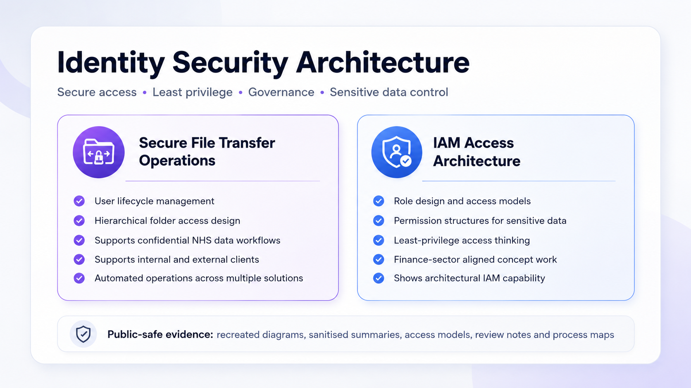
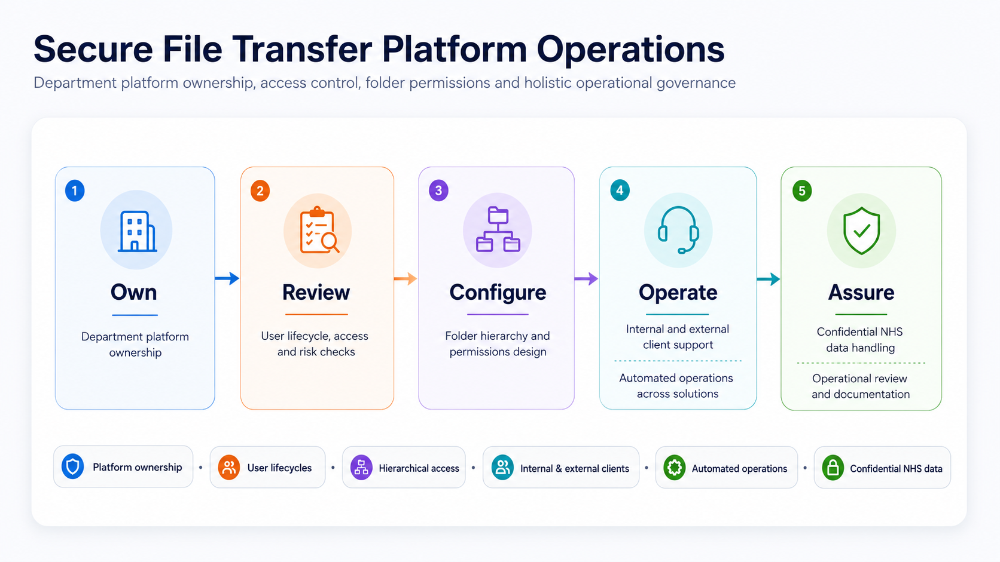

# 🏛️ Identity Security Architecture

## Overview

This section shows my IAM and access governance work across secure access, least privilege, permission modelling, and secure file transfer operations.

The strongest evidence here is the secure file transfer platform work, supported by IAM architecture evidence for sensitive data access control.

---

## Project Areas

| Project Area | Purpose |
| :--- | :--- |
| **[Secure File Transfer Platform Operations](./secure-file-transfer-platform-operations/)** | Workplace-aligned evidence covering secure transfer operations, platform access, folder structures, permissions, operational review, and confidentiality-safe documentation |
| **[IAM Architecture for Financial Data Access Control](./iam-architecture-financial-data-access-control/)** | IAM design evidence covering sensitive data access, role-based access, permission models, least privilege, and governance considerations |

---

## Evidence Preview

### Secure File Transfer Platform Operations

### IAM Access Control Model

---

## Key Capabilities Demonstrated

- IAM architecture thinking
- Access governance
- Least privilege design
- RBAC and permission modelling
- Secure data access control
- Secure file transfer operations
- Platform access review
- Risk-aware documentation
- Public-safe evidence handling

---

## Security and IAM Relevance

This section links IAM design with practical access control and secure operations.

The evidence shows how access can be structured, reviewed, and documented to reduce risk, support least privilege, and protect sensitive data.

---

## Evidence Approach

Evidence in this section may include:

- Access control models
- Permission models
- Recreated diagrams
- Sanitised workflow summaries
- Review templates
- Process maps
- Risk notes

No confidential organisational data, client information, internal URLs, tenant details, production secrets, ticket references, or real user data are included.
