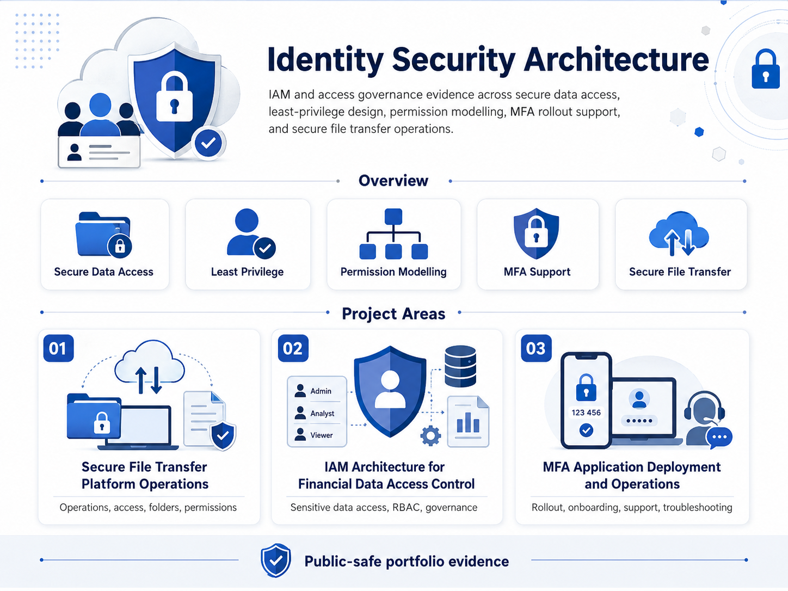

# 🏛️ Identity Security Architecture

  <strong><a href="../README.md">← Back to Portfolio Overview</a></strong>

  

---

## Identity Security Architecture Navigation

<table>
  <tr>
    <th align="left" width="420">Domain</th>
    <th align="left">Evidence Focus</th>
  </tr>
  <tr>
    <td width="420" nowrap>🏦 <strong><a href="./financial-data-access-control-architecture/">Financial&nbsp;Data&nbsp;Access&nbsp;Control&nbsp;Architecture</a></strong></td>
    <td>IAM design for sensitive financial data access, role-based permissions, least privilege, and governance controls.</td>
  </tr>
  <tr>
    <td width="420" nowrap>🔐 <strong><a href="./mfa-application-deployment-and-operations/">MFA&nbsp;Application&nbsp;Deployment&nbsp;and&nbsp;Operations</a></strong></td>
    <td>MFA deployment operations, user onboarding, access troubleshooting, application access controls, and post-deployment support.</td>
  </tr>
  <tr>
    <td width="420" nowrap>📁 <strong><a href="./secure-file-transfer-platform-operations/">Secure&nbsp;File&nbsp;Transfer&nbsp;Platform&nbsp;Operations</a></strong></td>
    <td>Secure file transfer access, folder permissions, platform access review, operational checks, and public-safe documentation.</td>
  </tr>
</table>
