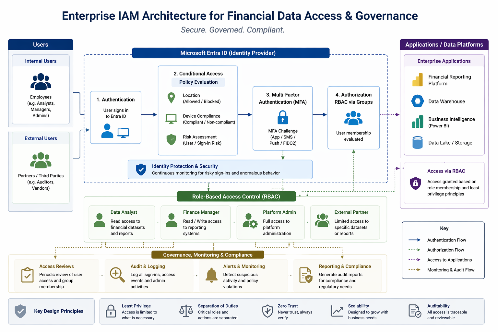

# 🏦 Enterprise IAM Architecture for Financial Data Access & Governance
**Identity Lifecycle, Access Control, and Security Design for Regulated Environments**

---

## 📌 Overview

This project presents a practical Identity and Access Management (IAM) architecture designed to secure access to **sensitive financial data platforms** within a regulated environment.

The design reflects real-world IAM challenges including:

- Managing internal and external identities  
- Securing access to financial and analytics platforms  
- Enforcing strong authentication and access control  
- Supporting auditability and regulatory compliance  

The solution is centred around **Microsoft Entra ID**, with a focus on **identity lifecycle management, RBAC design, and access governance**.

---

## 🎯 Objectives

- Design a secure IAM architecture for financial data access  
- Enforce strong authentication using Multi-Factor Authentication (MFA)  
- Implement role-based access control (RBAC) aligned to least privilege  
- Support identity lifecycle processes (Joiners, Movers, Leavers)  
- Enable access governance through reviews and auditing  
- Align with regulatory and data security requirements  

---

## 🏗️ Architecture Diagram

---

## 🔍 Architecture Explanation

This architecture centralises identity through Microsoft Entra ID, enforcing authentication and access control across financial data platforms.

- Users authenticate via Entra ID with MFA enforced  
- Conditional Access evaluates risk (device, location, behaviour)  
- Access is granted via group-based RBAC  
- Applications are accessed through controlled identity flows  
- All activity is logged for audit and compliance  

---

## 🔄 Access Flow

1. User signs in via Microsoft Entra ID  
2. Conditional Access evaluates:
   - Location  
   - Device compliance  
   - Risk signals  
3. Multi-Factor Authentication is enforced  
4. User is mapped to RBAC groups  
5. Access to applications is granted based on role  
6. Activity is logged and monitored  

---

## 🔐 Access Model Design

### Role-Based Access Control (RBAC)

Access is assigned through **security groups**, not directly to users.

#### Example Role Structure

| Role | Access Scope |
|------|-------------|
| Data Analyst | Read access to financial datasets |
| Finance Manager | Read/write access to reporting systems |
| Platform Admin | Full administrative access |
| External Partner | Restricted dataset access |

---

### Key Principles

- **Least Privilege:** Minimal required access  
- **Separation of Duties:** Admin vs user roles  
- **Scalability:** Group-based access model  
- **Consistency:** Standardised role assignment  

---

## 🔄 Identity Lifecycle (JML)

### Joiners
- Provisioned in Entra ID  
- Assigned to role-based groups  
- Access granted automatically  

### Movers
- Role changes trigger group updates  
- Old access removed  
- New access applied  

### Leavers
- Immediate account disablement  
- Removal from all access groups  
- Full access revocation  

---

## 🔐 Authentication & Security Controls

### Multi-Factor Authentication (MFA)

- Enforced for all users accessing sensitive systems  
- Additional controls for privileged users  

---

### Conditional Access (Conceptual)

- Restrict access by location  
- Require compliant devices  
- Enforce risk-based authentication  

---

## 📊 Access Governance

### Access Reviews

- Periodic validation of user permissions  
- Removal of unnecessary access  
- Focus on privileged and external users  

---

### Auditing & Monitoring

- Logging of authentication and access events  
- Monitoring for suspicious activity  
- Support for compliance and audit reporting  

---

## 👤 Example Access Scenario

**User:** Data Analyst (Internal)

1. User signs into Entra ID  
2. Conditional Access checks:
   - Approved location  
   - Compliant device  
3. MFA is required  
4. User is part of `Finance-Analysts` group  
5. RBAC grants read access to reporting platform  

**Outcome:**  
User can securely access financial reports but cannot modify data.

---

## 🔐 Example Conditional Access Policy

- **Target:** Users accessing financial applications  
- **Controls:**
  - Require MFA  
  - Require compliant device  
  - Restrict access from non-approved locations  
- **Exception:** Break-glass accounts (monitored)  

---

## 🧠 Key Design Principles

- Security-first, Zero Trust aligned  
- Identity as the primary control plane  
- Least privilege by default  
- Full auditability of access  
- Scalable enterprise design  

---

## 🔮 Future Enhancements

- Privileged Identity Management (PIM) integration  
- Automated access request workflows  
- Advanced risk-based Conditional Access  
- Integration with access governance platforms  

---

## 🎯 Outcome

This project demonstrates a structured IAM architecture combining:

- Identity lifecycle management  
- Secure authentication controls  
- Role-based access design  
- Governance and compliance enforcement  

It reflects real-world IAM design considerations relevant to **financial services and regulated environments**.

---

*Maintained by Jacob Adedoyin*
