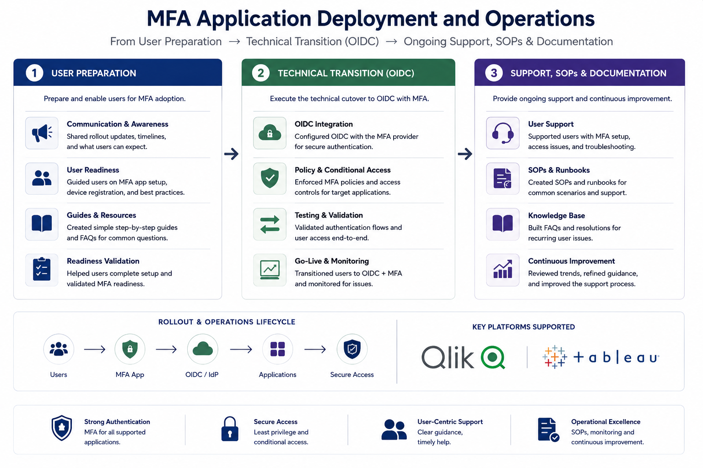

# 🔐 MFA Application Deployment and Operations

## Overview

Practical IAM and operational support project covering MFA deployment for secure access to Qlik and Tableau data platforms.

The work included user preparation, OIDC transition support, access issue triage, SOPs, documentation, and post-deployment improvement.

## Project Relevance

This project reflects real-world identity and access work in a secure data platform environment, where users need reliable access while authentication controls are strengthened.

The focus was on supporting the full operational rollout: preparing users, reducing access disruption, handling issues, documenting repeatable processes, and improving support after deployment.

## Project Scope

| Area | Hiring Manager Relevance |
|---|---|
| User preparation | Supported communications, readiness guidance, MFA setup, and user awareness before rollout |
| Authentication transition | Supported OIDC-based authentication transition with MFA for secure application access |
| Access continuity | Helped reduce disruption during authentication and access changes |
| Support operations | Assisted with MFA setup, access issues, troubleshooting, and escalation |
| Documentation | Contributed to SOPs, FAQs, user guidance, and repeatable support processes |
| Post-deployment improvement | Identified recurring issues, support trends, and improvement opportunities |

## IAM Skills Demonstrated

- MFA adoption and strong authentication support
- OIDC-based authentication transition awareness
- Secure application access support
- Conditional Access awareness
- User onboarding and readiness support
- Access issue triage and escalation
- SOPs, runbooks, FAQs, and operational documentation
- Post-deployment review and continuous improvement

## Operational Evidence

This project includes recreated and sanitised examples of operational evidence used to support MFA deployment and post-go-live activity.

## My Role

I supported the rollout by helping users prepare for MFA adoption, assisting with setup and access issues, following escalation routes, contributing to support documentation, and identifying recurring post-deployment issues.

This included work across stakeholder communication, technical rollout support, sign-up tracking, email drafting, risk awareness, test user support, support inbox handling, quick help guides, escalation to the development team, internal user management SOPs, and handover to department support teams.

## Key Outcome

The project strengthened secure access to Qlik and Tableau while supporting users through preparation, technical transition, go-live, and ongoing operations.

It demonstrates practical IAM support in an environment where security, usability, access continuity, documentation, and stakeholder communication all matter.

## Confidentiality

This project uses recreated and sanitised evidence only. It does not include real user records, authentication logs, tenant details, tickets, internal screenshots, internal URLs, or confidential rollout material.
