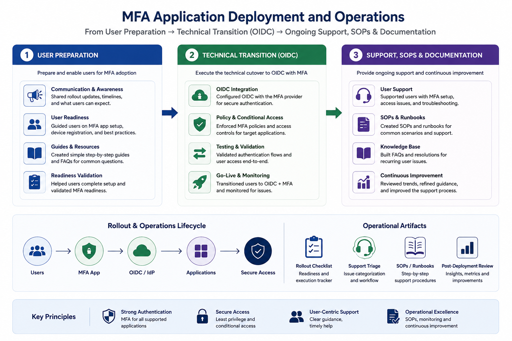
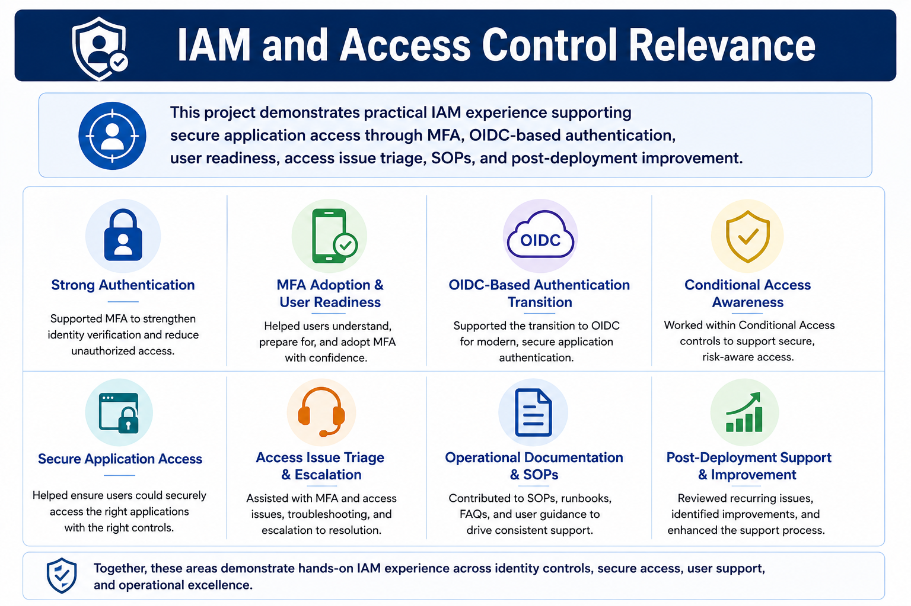

# 🔐 MFA Application Deployment and Operations

## Overview

This project shows experience supporting an MFA application deployment used to strengthen secure access to sensitive data platforms.

The work covered user preparation, OIDC-based authentication transition support, access continuity, issue triage, SOPs, documentation, and post-deployment improvement.

## IAM Skills Demonstrated

This project demonstrates practical IAM experience across:

- Strong authentication and MFA adoption
- OIDC-based authentication transition support
- Conditional Access awareness
- Secure application access
- Access issue triage and escalation
- SOPs, user guidance, and operational documentation
- Post-deployment review and improvement

## Project Focus

| Area | Relevance |
|---|---|
| User preparation | Helped users understand MFA setup, timelines, and access changes |
| Technical transition | Supported movement to OIDC-based authentication with MFA |
| Access continuity | Helped reduce disruption during authentication changes |
| Support operations | Assisted with MFA setup, access issues, and troubleshooting |
| SOPs and documentation | Supported guidance, FAQs, and repeatable support processes |
| Post-deployment review | Identified recurring issues and improvement areas |

## My Role

I supported the deployment and operational process by helping users prepare for MFA adoption, assisting with setup and access issues, following escalation routes, contributing to support notes, and identifying recurring post-deployment issues.
