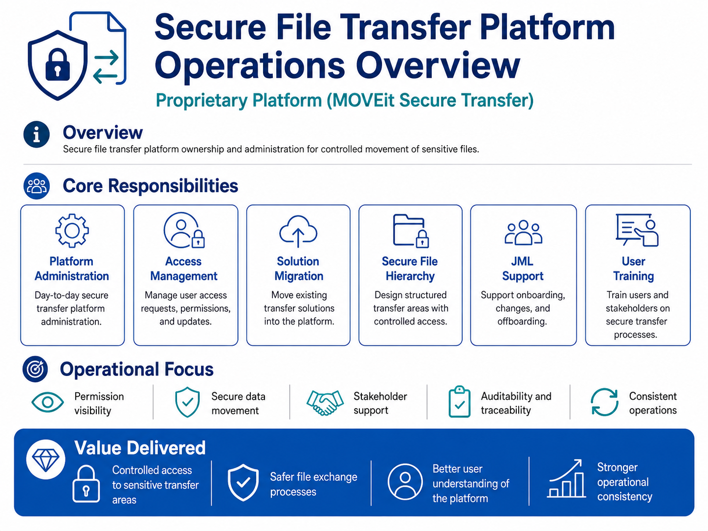
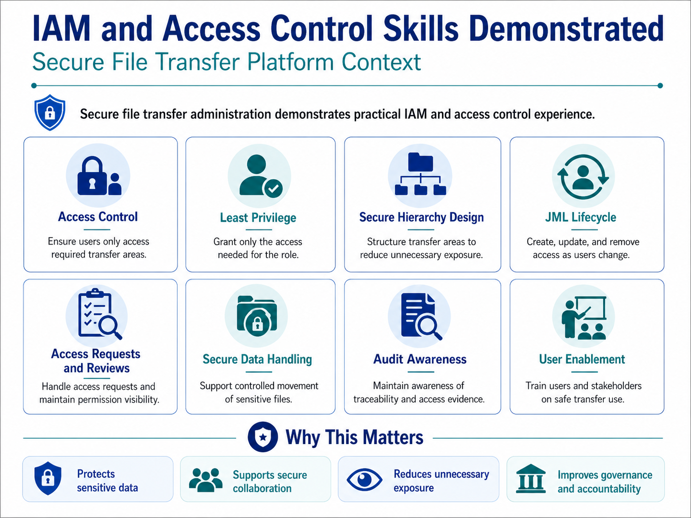
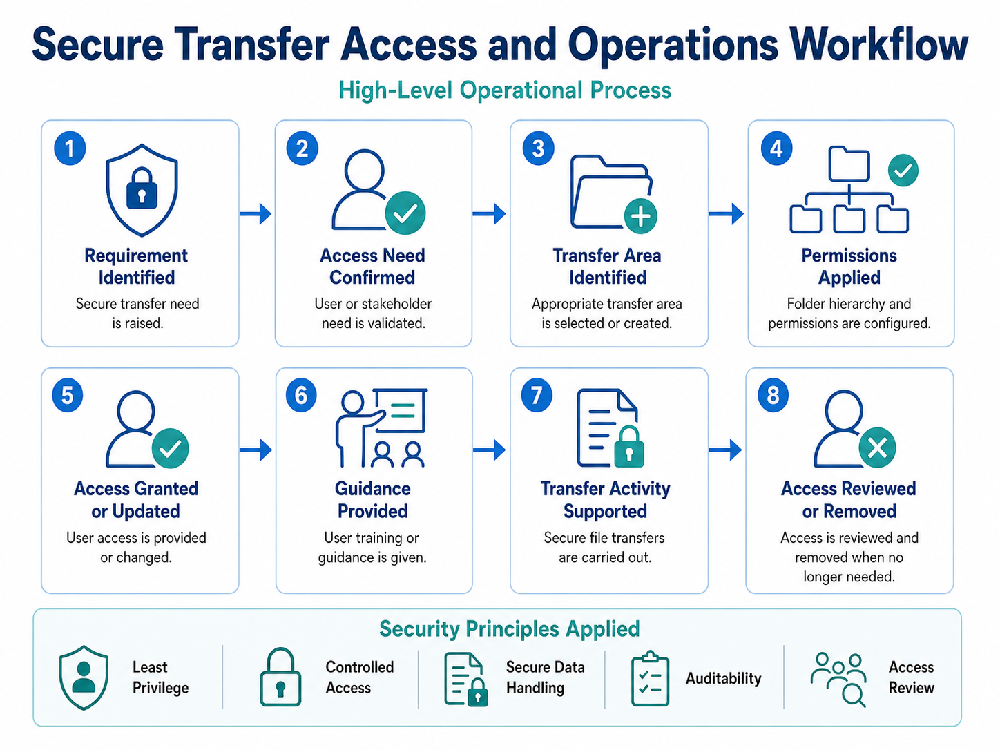

# Secure File Transfer Platform Operations

## Overview

This project demonstrates ownership and administration of a secure file transfer platform used for controlled movement of sensitive files.

The work focused on access management, secure transfer operations, migration support, folder hierarchy design, JML activity, and stakeholder training.

## Platform

- MOVEit Secure Transfer

## IAM and Security Skills

Key skills demonstrated:

- Secure platform administration
- User access management
- Least privilege permissions
- Secure folder hierarchy design
- Joiner, mover, and leaver support
- Permission visibility
- Secure data movement
- Audit and traceability awareness
- User and stakeholder training

## Operations Workflow

## Evidence Pack

| Evidence | Location |
|---|---|
| Operations overview | `assets/secure-file-transfer-operations-overview.png` |
| IAM and access control skills | `assets/secure-transfer-iam-access-control-skills.png` |
| Access operations workflow | `assets/secure-transfer-access-operations-workflow.png` |
| Access request template | `assets/secure-transfer-access-request-template.md` |
| Migration checklist | `assets/secure-transfer-migration-checklist.md` |
| Permission matrix template | `assets/secure-transfer-permission-matrix-template.md` |

## Confidentiality

This project uses recreated and sanitised evidence only. It does not include real platform screenshots, folder paths, file names, user records, transfer logs, IP addresses, internal URLs, or confidential operational details.
