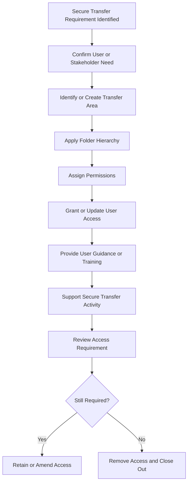

# Secure Transfer Workflow

## Purpose

This workflow shows a high-level secure file transfer process for MOVEit Secure Transfer.

It demonstrates how access requirements, secure folder structure, permissions, user support, and transfer operations can be managed in a controlled way.

## Workflow

