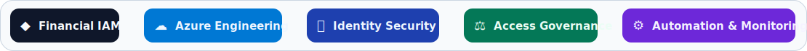
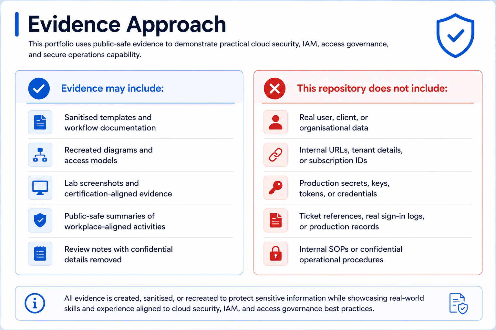
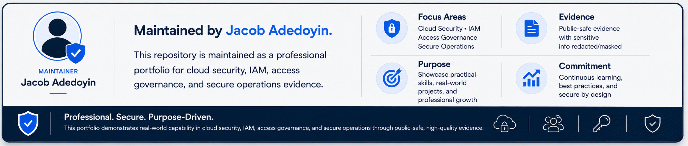

# Cloud Security and IAM Portfolio

  

> **Public-safe evidence only:** all evidence is sanitised and excludes confidential data, client information, tenant details, internal URLs, secrets, production records, real user data, and sensitive operational details.

---
## Portfolio Purpose

This portfolio demonstrates workplace-aligned capability across cloud engineering, identity and access management, access governance, secure data access, monitoring, automation, and regulated cloud security operations.

---
## 🧭 Portfolio Navigation

☁️ **[Azure Cloud Engineering](Projects/azure-cloud-engineering)**  
Azure governance · Entra ID · RBAC · Monitoring · KQL · Terraform · Bicep

🏛️ **[Identity Security Architecture](Projects/identity-security-architecture)**  
Financial IAM · MFA · Least privilege · Secure transfer · Access governance · Documentation

📊 **[Data Analytics Platform Management](Projects/data-analytics-platform-management)**  
Qlik · Tableau · JML workflows · Licence tracking · Access reviews · Reporting

---

## Technical Skills Demonstrated

  

---

## Evidence Approach

  

---

---

  

