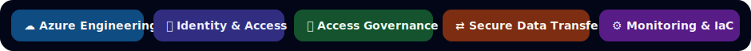

# Cloud Security and IAM Portfolio

  

> **Public-safe evidence only:** all evidence is sanitised and excludes confidential data, client information, tenant details, internal URLs, secrets, production records, real user data, and sensitive operational details.

  

---
## Portfolio Areas

  <strong><a href="Projects">Explore portfolio projects and evidence →</a></strong>

<table>
  <tr>
    <th align="left" width="360">Area</th>
    <th align="left">Evidence Focus</th>
  </tr>
  <tr>
    <td width="360" style="white-space: nowrap;">☁️ <strong><a href="Projects/azure-cloud-engineering">Azure&nbsp;Cloud&nbsp;Engineering</a></strong></td>
    <td>Azure governance, Entra ID integration, RBAC, policy, monitoring, KQL, automation, Terraform/Bicep, and secure cloud operations evidence.</td>
  </tr>
  <tr>
    <td width="360" style="white-space: nowrap;">🏛️ <strong><a href="Projects/identity-security-architecture">Identity&nbsp;Security&nbsp;Architecture</a></strong></td>
    <td>Financial data access control, MFA deployment operations, secure file transfer permissions, least-privilege design, access governance, and IAM documentation.</td>
  </tr>
  <tr>
    <td width="360" style="white-space: nowrap;">📊 <strong><a href="Projects/data-analytics-platform-management">Data&nbsp;Analytics&nbsp;Platform&nbsp;Management</a></strong></td>
    <td>Qlik and Tableau access governance, JML workflows, licence and entitlement tracking, access reviews, reporting, and operational control evidence.</td>
  </tr>
</table>

---

## Technical Skills

  

---

## Evidence Approach

  

---

## Purpose

This portfolio evidences capability across cloud engineering, IAM, access governance, secure data access, monitoring, automation, and security-conscious documentation.

It combines workplace-aligned delivery evidence with technical projects relevant to Azure IAM engineering, cloud security operations, access governance, and regulated technology environments.

---

  

