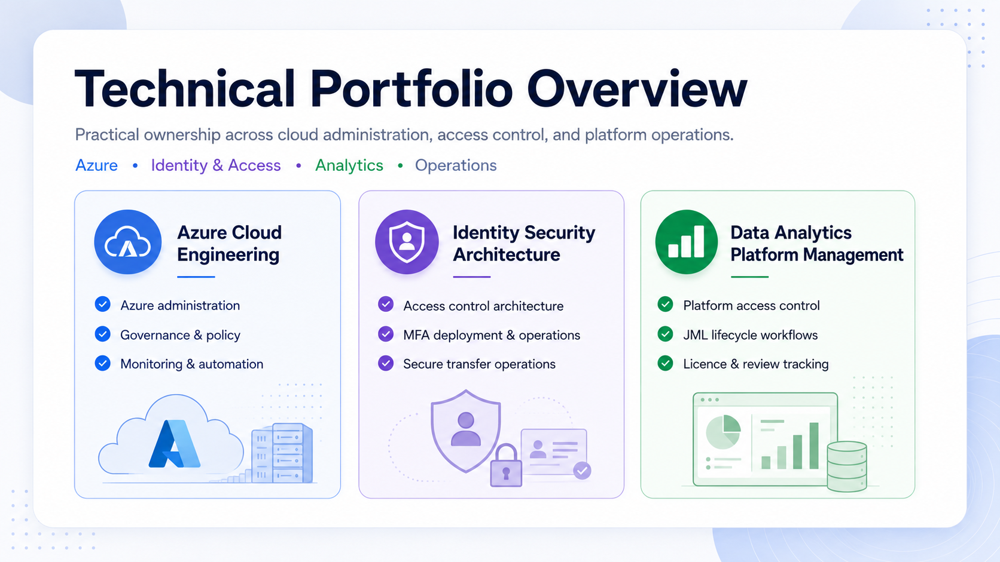
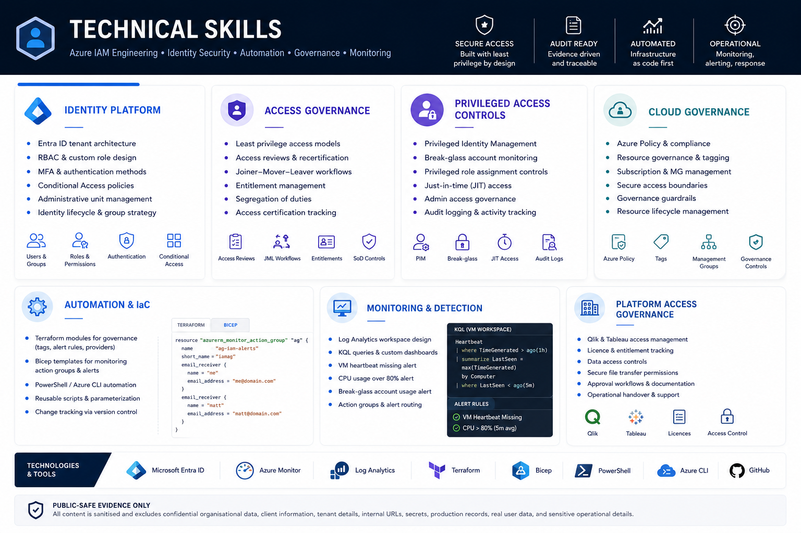
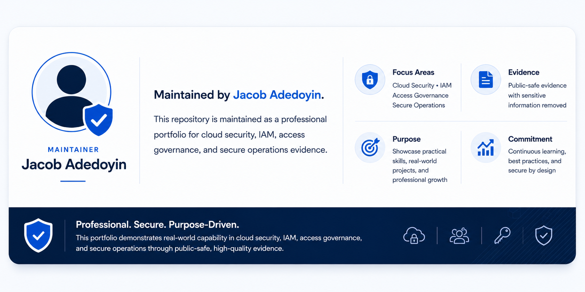

# Cloud Security and IAM Portfolio
A public-safe technical portfolio showcasing hands-on experience across Azure administration, IAM, access governance, secure file transfer operations, analytics platform access, and MFA deployment support.

> **Public-safe evidence only:** all evidence is sanitised and excludes confidential data, client information, tenant details, internal URLs, secrets, production records, real user data, and sensitive operational details.

---

---

## Portfolio Areas

<table>
  <tr>
    <th align="left" width="360">Area</th>
    <th align="left">Evidence Focus</th>
  </tr>
  <tr>
    <td width="360" style="white-space: nowrap;">☁️ <strong><a href="Projects/azure-cloud-engineering">Azure&nbsp;Cloud&nbsp;Engineering</a></strong></td>
    <td>Azure administration, Entra ID, RBAC, monitoring, security foundations, and cloud lab evidence</td>
  </tr>
  <tr>
    <td width="360" style="white-space: nowrap;">🏛️ <strong><a href="Projects/identity-security-architecture">Identity&nbsp;Security&nbsp;Architecture</a></strong></td>
    <td>IAM architecture, secure data access, least privilege, access governance, and secure file transfer operations</td>
  </tr>
  <tr>
    <td width="360" style="white-space: nowrap;">📊 <strong><a href="Projects/data-analytics-platform-management">Data&nbsp;Analytics&nbsp;Platform&nbsp;Management</a></strong></td>
    <td>Qlik and Tableau access management, licence tracking, JML workflows, and access review evidence</td>
  </tr>
</table>

---

---

## Evidence Approach

This portfolio uses public-safe evidence to demonstrate practical cloud security, IAM, access governance, and secure operations capability.

Evidence may include:

- Sanitised templates and workflow documentation
- Recreated diagrams and access models
- Lab screenshots and certification-aligned evidence
- Public-safe summaries of workplace-aligned activities
- Review notes with confidential details removed

This repository does **not** include:

- Real user, client, or organisational data
- Internal URLs, tenant details, or subscription IDs
- Production secrets, keys, tokens, or credentials
- Ticket references, real sign-in logs, or production records
- Internal SOPs or confidential operational procedures

---

## Purpose

This portfolio is designed to evidence practical capability across cloud administration, IAM, access governance, secure data access, platform support, monitoring, and security-conscious documentation.

It combines workplace-aligned experience with hands-on technical learning relevant to cloud security, IAM engineering, access governance, and regulated technology environments.

---

## Maintainer

## Maintainer

  

