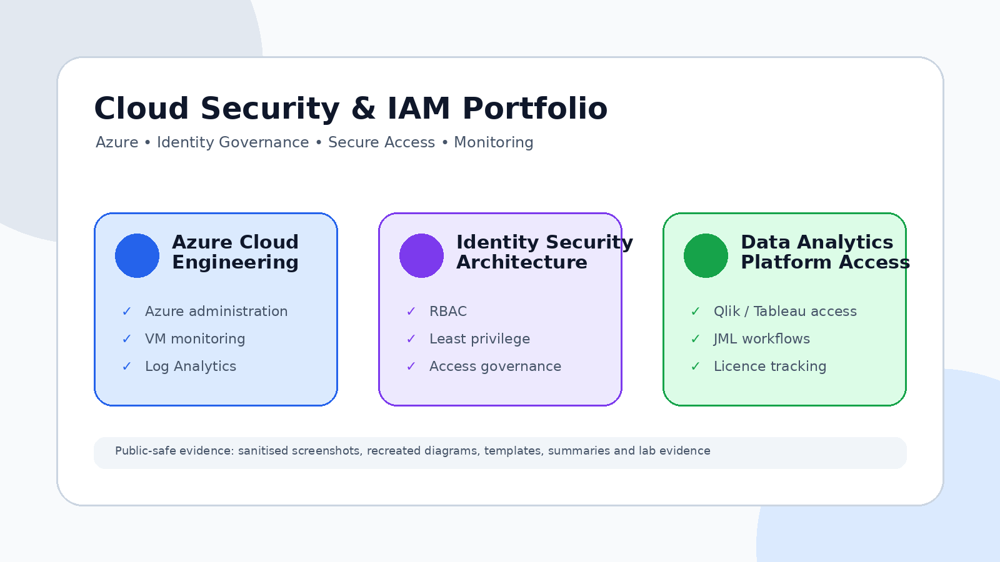
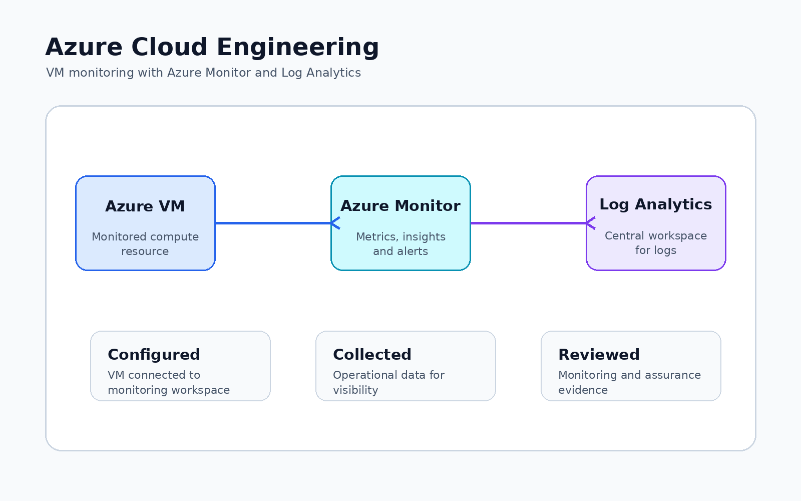
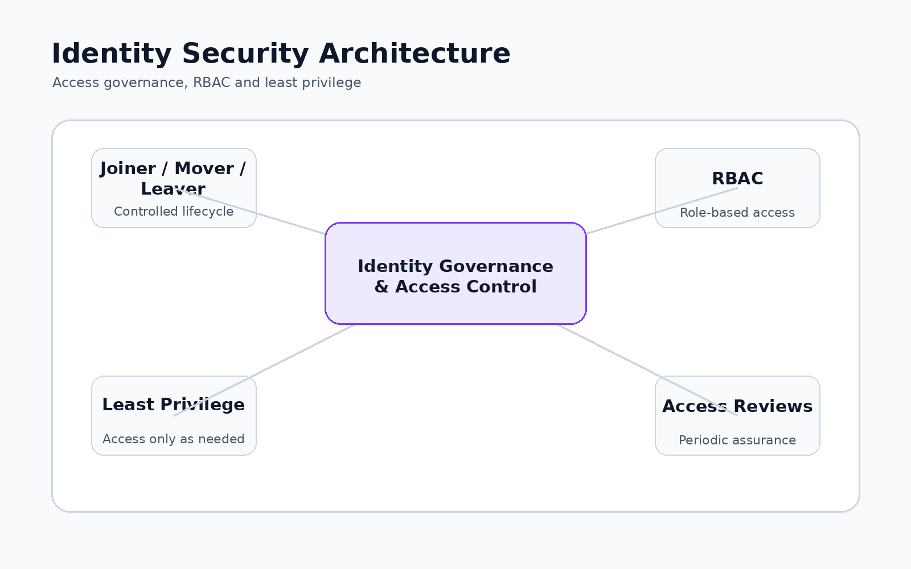
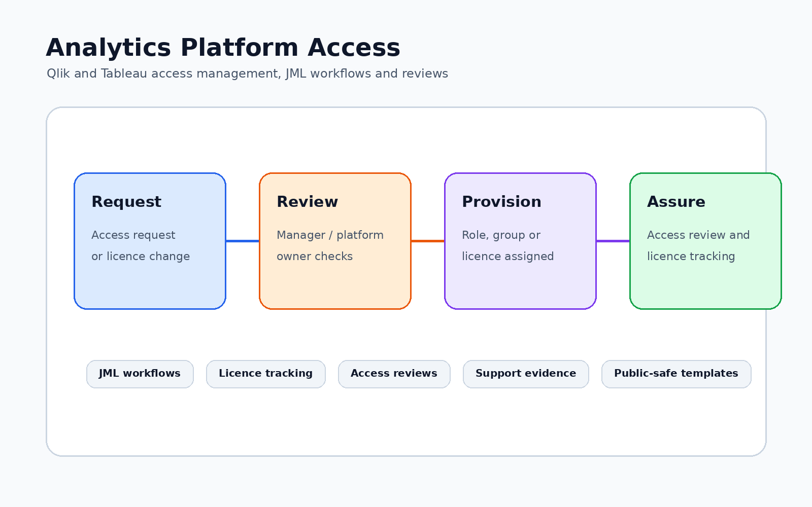

# Cloud Security and IAM Portfolio

A professional portfolio demonstrating practical experience across cloud administration, identity and access management, Azure security, access governance, secure data access, analytics platform access support, and secure file transfer operations.

All evidence is public-safe and sanitised. No confidential organisational data, client information, tenant details, internal URLs, secrets, or production records are included.

---

## Portfolio Overview

---

## Navigation

| Section | Description |
|---|---|
| [Azure Cloud Engineering](Projects/azure-cloud-engineering) | Azure administration, Microsoft Entra ID, RBAC, monitoring, security foundations, and certification-aligned cloud labs |
| [Identity Security Architecture](Projects/identity-security-architecture) | IAM architecture, secure data access, RBAC, least privilege, secure folder structures, and secure file transfer operations |
| [Data Analytics Platform Management](Projects/data-analytics-platform-management) | Qlik and Tableau access management, licence tracking, JML workflows, access reviews, and support evidence |

---

## Evidence Preview

| Area | Preview |
|---|---|
| [Azure Cloud Engineering](Projects/azure-cloud-engineering) |  |
| [Identity Security Architecture](Projects/identity-security-architecture) |  |
| [Data Analytics Platform Management](Projects/data-analytics-platform-management) |  |

---

## Overview

This portfolio demonstrates practical capability across:

- Azure administration and cloud operations
- Microsoft Entra ID and identity management
- RBAC, MFA, Conditional Access, and least privilege
- Access governance and joiner / mover / leaver processes
- Secure data access design and permission models
- Secure file transfer operations
- Qlik and Tableau platform access support
- Monitoring, documentation, and public-safe evidence capture

---

## Portfolio Areas

| Area | Focus |
|---|---|
| [Azure Cloud Engineering](Projects/azure-cloud-engineering) | Azure administration, Microsoft Entra ID, monitoring, security foundations, certification evidence, and lab work |
| [Identity Security Architecture](Projects/identity-security-architecture) | IAM design, secure data access, RBAC, least privilege, secure folder structures, and secure file transfer operations |
| [Data Analytics Platform Management](Projects/data-analytics-platform-management) | Qlik and Tableau access workflows, licence tracking, access reviews, JML processes, and support evidence |

---

## Azure Cloud Engineering

**[View Azure Cloud Engineering](Projects/azure-cloud-engineering)**

Practical Azure and Microsoft Entra ID evidence covering cloud administration, RBAC, access control, monitoring, security foundations, Azure Monitor, Log Analytics, and AZ-900, SC-900, and AZ-104-aligned learning.

---

## Identity Security Architecture

**[View Identity Security Architecture](Projects/identity-security-architecture)**

IAM and secure access evidence covering identity architecture, RBAC, least privilege, secure data access, access governance, permission models, secure folder structures, and secure file transfer operations.

---

## Data Analytics Platform Management

**[View Data Analytics Platform Management](Projects/data-analytics-platform-management)**

Platform support evidence covering Qlik and Tableau access management, licence tracking, access reviews, JML workflows, support processes, templates, and sanitised operational documentation.

---

## Core Skills Demonstrated

| Skill Area | Evidence |
|---|---|
| Azure administration | Azure operations, resource management, monitoring, security foundations, and AZ-104-aligned labs |
| Identity and access management | Microsoft Entra ID, RBAC, MFA, Conditional Access, JML processes, and access governance |
| Cloud security | Secure configuration, least privilege, monitoring, governance controls, and operational review |
| Secure data access | Permission models, secure data access design, folder structures, and access control documentation |
| Secure file transfer | Secure file transfer operations, permissions, folder structures, and migration support |
| Analytics platform support | Qlik and Tableau access workflows, licence tracking, support evidence, and access reviews |
| Governance and documentation | Sanitised templates, recreated diagrams, review evidence, summaries, and public-safe documentation |
| Security awareness | Confidentiality, risk awareness, least privilege, auditability, and safe evidence handling |

---

## Evidence Approach

This portfolio uses public-safe evidence, including:

- Sanitised templates
- Recreated diagrams
- Lab screenshots
- Public-safe certificates
- Workflow documentation
- Work-based summaries with confidential details removed

This repository does **not** include:

- Real user data
- Client information
- Internal URLs
- Tenant IDs
- Subscription IDs
- Production secrets
- Ticket references
- Real sign-in logs
- Internal SOPs
- Confidential procedures

---

## Purpose

This portfolio is designed to evidence practical capability in cloud administration, identity and access management, access governance, secure data access, platform support, monitoring, and security-conscious documentation.

It is intended to show both workplace-aligned experience and hands-on technical learning in areas relevant to cloud security, IAM engineering, access governance, and regulated technology environments.

---

## Maintainer

Maintained by **Jacob Adedoyin**.

This repository is open source and intended as a professional cloud, identity, access management, and security portfolio.
